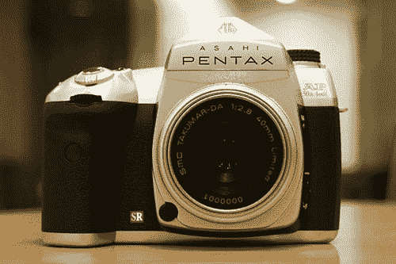
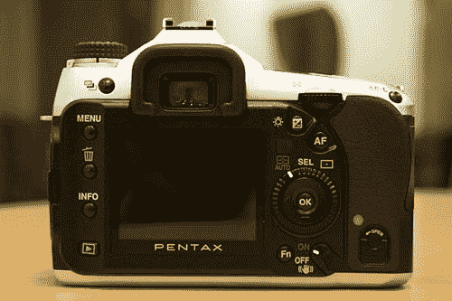

# 宾得 50 周年 DSLR | TechCrunch

> 原文：<https://web.archive.org/web/http://techcrunch.com/2007/06/01/pentax-50th-anniversary-dslr/>

宾得已经 50 岁了，还有什么比发布一款特别的周年纪念版来向世界展示你的进步更好的方式呢:AP50 dSLR。朝日新闻是怎么回事？不，不是啤酒，傻瓜。朝日光学是半个世纪前它们的名字。不管怎样，让我们聊聊 AP50 和这款数码单反能做什么。

这真的只是一个玩笑，因为它实际上不会出售。然而，让我们梦想拥有这台机器。K10D 是 AP50 的基础，但也加入了一些选择性的设计元素。想知道为什么朝日改名叫宾得？我也是。显然，名称的改变来自于金字塔外壳，它允许从五棱镜取景器进行精确的预览。我想，有道理。也不要指望弹出式闪光灯，因为这是一个后撤功能。得到一个外部闪光灯说宾得。AP50 将在东京总部展出到 7 月底。应该有人把它偷出来，在易贝卖掉。最好是对我。

[打动](https://web.archive.org/web/20150922202352/http://dc.watch.impress.co.jp/cda/other/2007/06/01/6368.html)【via[电音](https://web.archive.org/web/20150922202352/http://www.electronista.com/articles/07/06/01/pentax.ap50/)