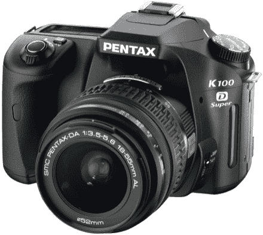

# 宾得宣布推出超高速 K100D | TechCrunch

> 原文：<https://web.archive.org/web/http://techcrunch.com/2007/06/28/pentax-announces-superfied-k100d/>

宾得宣布了他们一直受欢迎的 K100D 数码单反的更新，这是一款简单易用的入门级型号，甚至你的母亲也可以使用。那么 K100D **超级**有什么新鲜事？建立在岩石坚实的功能，如减少震动系统是一个突破性的除尘系统混合 SDM 镜头。如果这还不算好，那我不知道什么才算好。嗯。610 万像素 APS-C 侧边 CCD，11 点自动对焦机制，2.5 英寸 LCD 和 ISO 3200 怎么样？那肯定足以激起你的食欲。

你要等到 8 月份才能买一个，而且一定要带着你的存钱罐，因为这要花你 599.95 美元。

[新闻稿](https://web.archive.org/web/20150516142221/http://www.pentaximaging.com/footer/news_media_article?ArticleId=9997175)