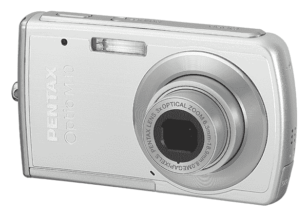
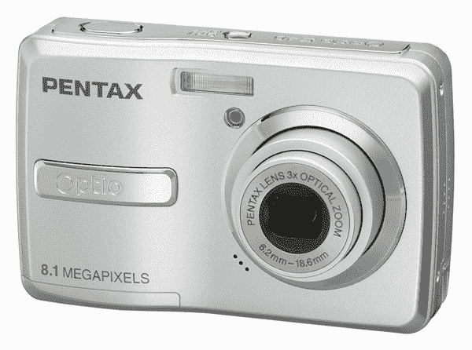
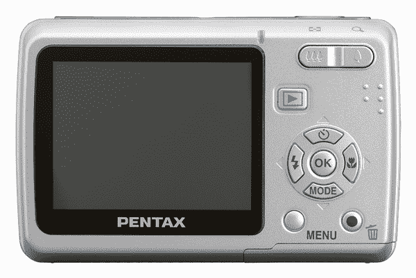

# 宾得宣布推出两款易于使用且价格合理的相机| TechCrunch

> 原文：<https://web.archive.org/web/http://techcrunch.com:80/2007/07/12/pentax-announces-two-easy-to-use-affordable-point-and-shoots/>

宾得推出了两款重量轻、价格合理的傻瓜相机，Optio M40 和 Optio E40。M40 是一个 800 万像素的庞然大物，采用流线型超薄设计的金属机身，拥有 3 倍光学变焦、4 倍数码变焦和一个大于寿命的 2.5 英寸液晶显示器。面部识别和数字防抖是宾得似乎擅长的两个关键功能。M40 提供了 16 种不同的摄影模式，一种新的日期印记功能，FotoNation 针对闪光灯拍摄的红眼减少补偿功能和 21.9MB 的内置内存。

E40 是一款入门级的 800 万像素数码相机，还具有面部识别、DSR、3 倍光学变焦和 4 倍数码变焦功能。这是一个完全的初学者相机，由 AA 电池供电，在需要更换之前可以拍摄多达 240 张照片。

宾得 Optio M40 将于 8 月发货，售价为 199.95 美元，Optio E40 将于 9 月发货，售价为 149.95 美元。

[新闻稿](https://web.archive.org/web/20140216170428/http://www.pentaximaging.com/footer/news_media_article?ArticleId=10004839)