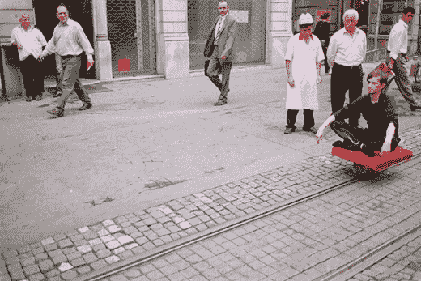

# 个人铁路服务概念| TechCrunch

> 原文：<https://web.archive.org/web/http://techcrunch.com/2007/01/22/personal-rail-service-concepts/>

# 个人铁路服务概念

也许你住在一个附近有废弃电车轨道的城市。或者，你住在废弃铁轨附近的郊区住宅里。不管怎样，这些个人轨道交通的概念都是天才。想象一下，你可以一个人沿着一组轨道骑行。

一些概念是机动化的，但其他的(如独特的冲浪板模型)依靠老式的滑板动作来保持你的前进。很高兴看到这种东西以地下方式实现，这样人们就可以开始建立轨道交通俱乐部和会议。你还在等什么？收回街道！

[官方网站](https://web.archive.org/web/20130628210259/http://hehe.org.free.fr/train/)【via Boing Boing】