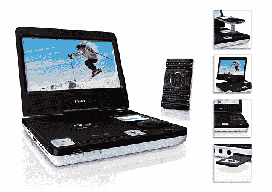

# 飞利浦 DCP850 便携式 DVD 播放器评论| TechCrunch

> 原文：<https://web.archive.org/web/http://techcrunch.com/2007/07/23/philips-dcp850-portable-dvd-player-review/>

在过去的六个月中，我旅行了很多次，我真的可以用一个便携式 DVD 播放器来淹没引擎的轰鸣声，航空公司做出的糟糕的电影选择，隔着两个座位哭泣的婴儿，或者我女朋友不断的喋喋不休(只是开玩笑，M)。虽然我在飞利浦 DCP850 评测期间没有乘坐过任何飞机，但我有过几次超过 1.5 小时的火车旅行，包括昨天一个讨厌的灌洗器坐在我面前，认为他是下一个伟大的白人说唱歌手。这绝对不是你的普通便携式 DVD 播放器。它有一些锦囊妙计。

DCP850 提供除 DVD 以外的多种来源的视频播放。你可以连接你的视频 iPod(它也可以给你的 iPod 充电)并播放你所有的 iTunes 内容。您还可以观看刻录了 DivX 文件的 DVD，并欣赏 MP3 CDs。如果你手边有 SD 或 MMC 卡，那么你也可以把它们连接起来，在巨大的旋转 8.5 英寸液晶屏幕上观看你的照片。你能说会聚装置吗？我想是的。

850 还包括一个红外遥控器，它与 iPod dock 齐平，让您可以控制 DCP850 采用的每一项功能。遥控器对我来说有点太宽了，但我只是一个吹毛求疵的人。我喜欢 850 的另一点是双 3.5 毫米耳机插孔，让你可以与某人依偎在一起，而不必使用分离器或成为每个人都有一个耳塞的蹩脚二人组。还有一个 AV-in 和 AV-out 插头，允许您利用附带的 RCA 电缆，因此您可以连接到您的家庭娱乐中心或酒店电视。标准音量和亮度控制也与其他插头集成在一起。对于长途汽车旅行，还包括一个点烟器适配器。

然而，对于 DCP850 来说，这并不全是好事。我注意到的第一件事是 DVD 启动时产生的振动量。感觉它随时都会起飞。扬声器是低于标准的，我发现自己插入我的手机比什么都重要。播放 DVD 时的电池续航时间约为 2 小时，而不是飞利浦吹嘘的 2.5 小时，但我一直调高了亮度。iPod 上的视频播放持续时间更长，仅超过 4.5 小时。如果您打算在飞机上使用 DCP850，我建议您将视频内容上传到 iPod。不过，这款设备最大的缺点是没有 iPod 控制功能。您不能通过红外遥控器浏览菜单，基本上是用它来播放和暂停音乐。

总的来说，DCP850 可以实现便携式 DVD 播放器的所有功能，iPod 视频功能也很棒，但电池续航时间和缺乏电池备份解决方案可能会让你在购买 199.99 美元的产品时三思而行。

[产品页面](https://web.archive.org/web/20151020023216/http://www.consumer.philips.com/consumer/catalog/tree/en/us/consumer/home_entertainment_gr_us_consumer/audio_systems_ca_us_consumer/su00303_su_us_consumer/ce/_activeTab_features/_productId_DCP850_37_US_CONSUMER/Docking_Entertainment_System+DCP850_37?proxybuster=RCXSZA5IIWHSRJ0RMRCSHQNHKFSESI5P)