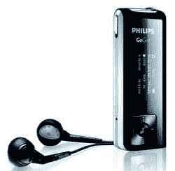

# 飞利浦 GoGear SA1335 Flash 播放器

> 原文：<https://web.archive.org/web/http://techcrunch.com:80/2006/08/28/philips-gogear-sa1335-flash-player/>

# 飞利浦 GoGear SA1335 Flash 播放器

飞利浦最近开始向商店进货，销售其光滑的 GoGear SA1334 Flash 播放器。GoGear 具有 1GB 的存储空间，精致的双色有机发光二极管，FM 调谐器，录音机，USB 2.0 连接，尺寸为 3.17 x 1.24 x 0.59 英寸。GoGear 还支持通过不可更换的电池播放 MP3、WMA 和 WAV 长达 12 小时。它还承诺其附带的挂绳便于携带。没有什么华而不实的东西，但考虑到 GoGear SA1334 的售价约为 100 美元，你可能不应该期待任何华而不实的东西。

[飞利浦 GoGear](https://web.archive.org/web/20130627213818/http://www.anythingbutipod.com/archives/2006/08/philips-gogear-sa1335-flash-player.php)