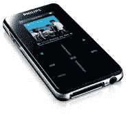

# 飞利浦 GoGear SA9200 基于闪存的 MP3 播放器–TechCrunch

> 原文：<https://web.archive.org/web/http://techcrunch.com/2006/09/01/philips-gogear-sa9200-flash-based-mp3-player/>

# 飞利浦 GoGear SA9200 基于闪存的 MP3 播放器

GoGear sa 9200 有 1GB 和 2GB 两种尺寸，目标是基于 iPod Nano flash 的 MP3 播放器市场。这款播放器只有 9 厘米(3.5 英寸)长，重 48 克。有对 MP3 和 DRMed WMA 文件的支持。它还有一个可选的坞站，可与飞利浦 Streamium 系统配合使用。屏幕尺寸为 1.7 英寸，有颜色，并且是触摸敏感的，考虑到它已经有单独的控制，这很有趣。

飞利浦表示，GoGear SA9200 的电池寿命为 14 小时，将于今年晚些时候上市，售价为 199 美元。

[GoGear SA9200:飞利浦的 Nano 竞争对手:IFA](https://web.archive.org/web/20201123185219/http://digital-lifestyles.info/display_page.asp?section=platforms&id=3641) 【数字生活方式】
飞利浦想从苹果的 Nano 中分一杯羹【电脑活跃】