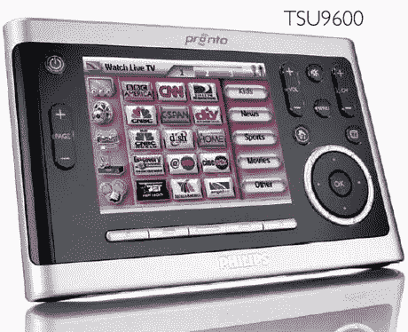

# 飞利浦提供娱乐解决方案| TechCrunch

> 原文：<https://web.archive.org/web/http://techcrunch.com:80/2006/09/26/philips-offers-entertainment-solutions/>

飞利浦今天正式发布了一批在过去几周内陆续流出的设备。Pronto TSU9600 遥控器比我的飞利浦高清电视还贵。这种遥控器通过红外支持几乎兼容所有已知的设备。遗憾的是，它不包括射频，但对于 1299.99 美元，我想你可以做出让步(不错的逻辑)。它有 64MB 的板载内存，并通过 WiFi 进行更新。

今天发布的另一个设备是它的便携式媒体中心。这基本上是一个增加了 DVR 功能的 PMP。它支持 MP3 和各种其他格式，包括 PlayForSure 服务。PMC7230 拥有 30GB 硬盘，售价为 349.99 美元。

最后，我们得到了飞利浦 BDP9000 蓝光播放器。它支持 HDMI，分辨率为 1080p。该播放器还包括分量视频输出，可以将那些旧的和坏的 DVD 上采样到 1080i。今年 10 月，它将与其他设备同时上市，售价为 999 美元。

[飞利浦](https://web.archive.org/web/20160220092140/http://www.philips.com/)