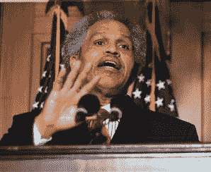

# 费城市长在被问及城市犯罪率后离开了 iPhone 生产线

> 原文：<https://web.archive.org/web/http://techcrunch.com/2007/06/29/philly-mayor-left-iphone-line-after-being-asked-about-citys-crime-rate/>

当一个不知名的人问他，“你怎么能坐在这里，这个城市已经有 200 起谋杀案了？”哎哟。(约翰·克里和他有多像。市长夹着尾巴离开了队伍。

这个故事的寓意是什么？如果你是一个美国大城市的市长，也许，也许，你会派一个实习生去拿你的玩具，而不是你自己去。只是我的直觉。

[费城市长等待 iPhone，然后离开生产线](https://web.archive.org/web/20150506123250/http://www.msnbc.msn.com/id/19508671/)[美联社/MSNBC]