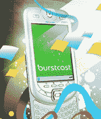

# 使用 Burstcast | TechCrunch 分享照片

> 原文：<https://web.archive.org/web/http://techcrunch.com/2007/06/05/photo-sharing-with-burstcast/>

想分享你用手机拍的照片吗？虽然通过电子邮件发送它们很容易，但您可以使用 Burstcast 发送到一个在线位置，供所有人查看。

Burstcast 是一个在线图像浏览器，可以让你直接用电子邮件将照片发送到网页上。你的电话号码和其他个人信息也是安全的，所以发布的只是照片。在网页上，你可以将你的账户标记为私人账户或公共账户，只要你点击发送，照片就会立刻上传到网上。

[突发广播](https://web.archive.org/web/20150401212946/http://www.burstcast.com/)