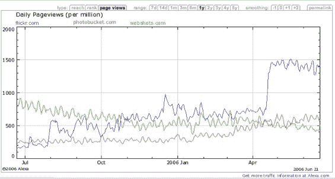
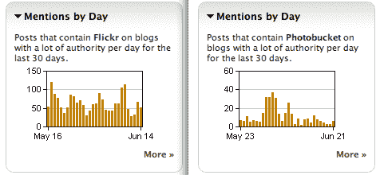

# Photobucket 与 Flickr 在 Alexa 和 Technorati TechCrunch 中的对比

> 原文：<https://web.archive.org/web/http://www.techcrunch.com:80/2006/06/22/photobucket-vs-flickr-in-alexa-and-technorati/>

# Alexa 和 Technorati 中的 Photobucket vs. Flickr

今天博客圈的头条新闻之一是一份新的[点击率图表](https://web.archive.org/web/20220930224221/http://weblogs.hitwise.com/leeann-prescott/2006/06/photobucket_leads_photo_sharin.html)发现 [Photobucket](https://web.archive.org/web/20220930224221/http://photobucket.com/) 在在线图片分享领域拥有 46%的领先市场份额，而 [Flickr](https://web.archive.org/web/20220930224221/http://flickr.com/) 仅占 6%的份额，排名第六。

对于在博客世界里 Flickr 是热门话题的部分人来说，这是一个很大的惊喜。

我在 Alexaholic 网站上查找了这两个网站，发现流量结果与 Hitwise 的图表非常不同。许多人长期以来一直声称 Alexa 产生低质量的结果，容易游戏，值得许多其他批评。如果是这样的话，雅虎。真的是网上访问量最大的网站吗？MySpace 真的是第五名吗？我们很多人经常从 Alexa 上谈论这些数字。(虽然 Hitwise [似乎找到了](https://web.archive.org/web/20220930224221/http://weblogs.hitwise.com/bill-tancer/2006/05/msn_and_yahoo_analysis.html)类似的数字。)

下图:蓝色是 Flickr 流量，红色是 Photobucket。[绿色的 Webshots.com](https://web.archive.org/web/20220930224221/http://webshots.com/)。

说到图表，这里有一些有趣的图表，量化了许多人在今天的讨论中所说的话:博客世界中最响亮的声音正在错过谈论 Flickr 的机会。Flickr 可能因其创新或其在创新社区中的参与或其在争议中的作用而值得博客报道——但在大多数博客中，在线 Photobucket 是一个更热门的话题！

查看这些图表，根据 Technorati 测量 Flickr 或 Photobucket 这两个词在有很多入站链接的博客(“高权威”)中出现的次数，与在没有很多入站链接的博客中出现的次数进行比较。我认为结果是显著的。

这里有一些不精确但很能说明问题的数据:权威博客写手写 Flickr 的频率是他们(我们)写 Photobucket 的 3 倍。博客圈作为一个整体使用 Photobucket 这个词的频率是我们使用 Flickr 这个词的 3 倍甚至更多。(TechCrunch 使用 Flickr 这个词的次数是 Photobucket 这个词的 11 倍。)这是否意味着高权威博主与大多数用户脱节了？有可能；这也可能意味着有趣并不等同于大量采用。

在下面的图表中，“高权威”在上面，所有博客在下面，Flickr 在左边，Photobucket 在右边。

