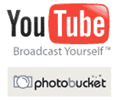

# Photobucket 是对谷歌/YouTube 的偷窃

> 原文：<https://web.archive.org/web/http://www.techcrunch.com:80/2007/05/07/photobucket-was-a-steal-v-googleyoutube/>

几乎以任何标准衡量，[与谷歌和 YouTube 的交易相比，MySpace 以绝对便宜的价格得到了 Photobucket】。这两家公司在某种程度上具有可比性——它们都拥有非常庞大的用户创建视频库，并且都是在 MySpace 的基础上建立自己的业务。Photobucket 还有一个巨大的共享照片库，这是 YouTube 从未涉足的业务。](https://web.archive.org/web/20220701090142/http://www.beta.techcrunch.com/2007/05/07/myspace-to-acquire-photobucket-for-250-million/)

谷歌[为 YouTube 支付了 16.5 亿美元的股票](https://web.archive.org/web/20220701090142/http://www.beta.techcrunch.com/2006/10/09/google-has-acquired-youtube/)。交易结束时，谷歌股票价值近 18 亿美元。Photobucket 以不到 1/5 的价格被收购——2.5 亿美元加上高达 5000 万美元的收益

2006 年 10 月宣布收购时，YouTube 的收入非常少。然而，Photobucket 今年有望突破 2500 万美元的预算。

此外，两家公司的相对规模也相差不远。在收购时，康姆斯克表示，YouTube 在美国的月访问量约为 2500 万。如今，Photobucket 在美国的月访问量约为 2000 万，相当于 YouTube 被收购时的 80%。

Photobucket 拥有 4000 万注册用户，并且每天增加大约 85000 名用户。他们的用户非常活跃，并向网络上传大量内容。收购时，YouTube 的注册用户远低于 Photobucket 的 4000 万。YouTube 过去(现在仍然)有很多人访问该网站观看视频，但真正创作和发布内容的用户要少得多。

抛开收入不谈，流量数据表明 Photobucket 的可比价格为 13 亿美元，是他们从 MySpace 实际收到的价格的 4 倍。从另一个角度来看，YouTube 的每位独立访问者的报酬约为 67 美元。Photobucket 只卖了 13 美元。

谷歌是否出价过高收购了 YouTube？MySpace 便宜买到 Photobucket 了吗？也许两者都有。但最终，成为一个类别中的第一名意味着你在收购中获得了溢价。就 YouTube 而言，溢价似乎是 4 倍左右。

另一个因素是:Photobucket 并没有产生 YouTube 所看到的竞价炒作。看起来最后的竞标者是 IAC 和 MySpace，在过去的几周中，其他一些竞标者退出了(也许[被 MySpace 屏蔽 Photobucket 视频的行为吓到了](https://web.archive.org/web/20220701090142/http://www.beta.techcrunch.com/2007/04/10/photobucket-videos-blocked-on-myspace/))。

在一年左右的时间里，对于新闻集团(拥有 MySpace)来说，这笔交易可能会像收购 MySpace 一样辉煌。有些人会说他们在玩肮脏的扑克，但在收购谈判的关键时刻关闭 Photobucket 是一个明智的举动，可能会使收购价格减少数亿美元。