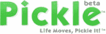

# 以 410 万美元收购 pickle——TechCrunch

> 原文：<https://web.archive.org/web/http://www.techcrunch.com:80/2007/08/08/pickle-purchased-for-41-million/>

# 以 410 万美元购买的泡菜

 图片和视频分享网站[Pickle.com](https://web.archive.org/web/20211027154714/http://www.crunchbase.com/company/pickle)已经被 Scripps Networks】以[报](https://web.archive.org/web/20211027154714/http://www.paidcontent.org/entry/419-scripps-networks-does-another-small-online-buy-photo-video-sharing-serv/)410 万美元收购。Scripps 是许多生活方式品牌背后的公司，如 DIY、食品网络、HGTV 和 Great American Country。这是他们继上个月 Recipezaar 之后的第二次网络采购。去年六月，我们报道了该网站的发布。

Pickle 与许多其他共享网站不同，它严重依赖电子邮件和手机提交个人和共享项目页面。它本质上是一种多模式服务，用于将您的内容转储到一个内容桶中，您可以通过他们的小部件公开这些内容。这项服务支持从电脑、手机或数码相机上传照片和视频到任何网站。Scripps 计划将该产品整合到现有生活方式的内容共享中。它是由位于阿灵顿的一家名为 Incando 的公司开发的。

在跳转(自动播放)之后，您可以看到他们的内容共享小部件的示例。
 [http://www . pickle . com/wdgt/pplayer/PB/pickle/31411/Silver/a 0311041111111111111](https://web.archive.org/web/20211027154714/http://www.pickle.com/wdgt/pplayer/PB/pickle/31411/Silver/A03110411111111111111)