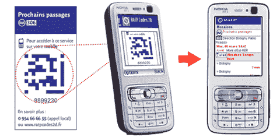

# 法国交通系统启动试点项目——TechCrunch

> 原文：<https://web.archive.org/web/http://techcrunch.com/2007/05/07/pilot-program-launched-for-french-transit-system/>

# 法国公交系统试点项目启动

全球无线商务解决方案提供商 Scanbuy，Inc .和咨询公司 faberNovel 与巴黎及其周边地区的主要公共交通运营商 Regie Autonome Transports Parisiens(RATP)合作创建了一个试点项目，为通勤者和旅行者提供使用手机和其他手持设备轻松获取信息的服务。这是在日本以外推出的第一个此类项目，它提供从手机访问的 2D 代码，为通勤者提供 WAP 上的实时交通信息。

目前，RATP 的一个测试项目正在喧闹的 le Grand 安装 Scanbuy 的交互式 2D 条形码技术，该技术为通勤者提供广泛的信息，包括公共汽车和地铁时刻表，以及区域地图和交通信息。该计划目前计划运行三到六个月，但如果成功，RATP 可能会考虑在巴黎及其周边地区的所有地铁站和公交车站引入该服务。

[RATP](https://web.archive.org/web/20201125150249/http://www.ratpcodes2d.fr/)