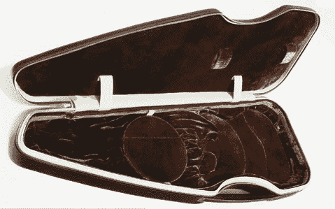

# 拉皮条我的吉他盒| TechCrunch

> 原文：<https://web.archive.org/web/http://techcrunch.com/2007/06/20/pimp-my-guitar-case/>

[几年前，Nick Comer-Calder](https://web.archive.org/web/20150923052807/http://www.calderoriginals.com/) 设计了一个疯狂的电吉他盒，使用了皮革、碳纤维(呃……那是横跨池塘的纤维)和丝绸，更不用说高科技的悬挂系统了。嗯，这不再只是一个概念，你现在可以实际购买它们…只需 3000 英镑加上增值税。

他还为古典吉他(3100)、小提琴(2800)和笔记本电脑(2120)做了一个平均案例。是的，您没有看错这些价格——美元价格翻倍。我可以看到在这些坏男孩中的一个身上保护一个极其稀有和非常昂贵的仪器，但是笔记本电脑呢？(是的，伙计，我有一台完好无损的老式苹果 PowerBook Duo，序列号很低……价值数百万。)

许多最好的乐器盒来自英国(我偏爱 Wiseman horn 的盒子)，但有时它们值这个惊人的价钱。这个值得商榷。

[商品页面](https://web.archive.org/web/20150923052807/http://www.calderoriginals.com/cord.html)【考尔德原创经[音乐事](https://web.archive.org/web/20150923052807/http://musicthing.blogspot.com/2007/06/calder-most-expensive-guitar-case-ever.html)