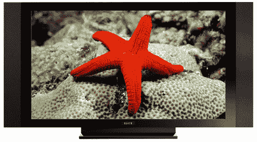

# 先锋李书行高清电视只做 720p | TechCrunch

> 原文：<https://web.archive.org/web/http://techcrunch.com/2007/07/18/pioneer-kuro-hdtvs-only-do-720p/>

哇哦。先锋有点过于努力地宣传其李书行高清电视系列。先锋的等离子通常很好，所以它的“看看他们有多棒！”有点麻烦。李书行线一分为二:李书行和精英李书行。两者都有 42 寸、50 寸和 60 寸的型号，但都不是 1080p。嗯……奇怪，考虑到现在是 2007 年。这两种型号都有像 HDMI 1.3 这样的常见问题，但 Pioneer 真的很难想象他们的黑人有多黑。我们得到:越黑就越好。

也许有人应该告诉先锋，无论它雇佣多少该死的广告公司(伙计们，那种眼神令人毛骨悚然，不酷)，它都很难向我们狂热的技术读者群销售 720p 电视机。这就像试图卖给我们一个太阳能手电筒。1080p 或者胸围。

[李书行](https://web.archive.org/web/20160220092945/http://www.pioneerelectronics.com/pna/v3/pg/kuro/demo/full/0,,2076_310069651,00.html)【先锋】