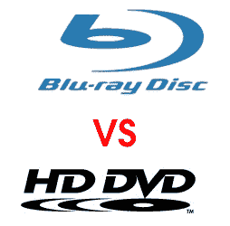

# 率先发布 HD DVD/蓝光光驱组合

> 原文：<https://web.archive.org/web/http://techcrunch.com/2006/09/01/pioneer-to-release-combo-hd-dvdblu-ray-drive/>

# 率先发布 HD DVD/蓝光光驱组合

先锋公司在 IFA 宣布，它将推出一款既能读取 HD DVD 光盘又能读取蓝光光盘的驱动器。BDR-103 将利用理光的智能蓝色激光二极管，可以识别插入的光盘类型。

过去已经发布了一些这样的驱动器。他们都没有胶凝，所以这里希望 BDR-103 实际上使其上市。如果我们开始看到更多这样的玩家，所有关于格式战争的噪音将会被有效地消除。
 [先锋策划 BDR-103 HD DVD/蓝光组合光驱](https://web.archive.org/web/20130627213930/http://www.engadget.com/2006/09/01/pioneer-planning-hd-dvd-blu-ray-combo-drive-the-bdr-103/)【Engadget】