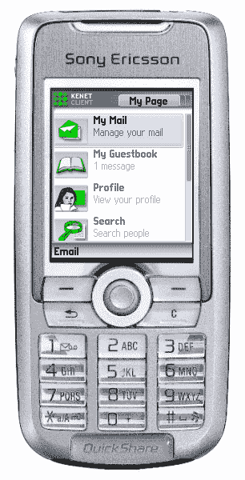

# Pitch 入侵:移动社交空间之战

> 原文：<https://web.archive.org/web/http://techcrunch.com/2006/11/22/pitch-invasion-the-battle-for-the-mobile-social-space/>

移动社交网络发生了什么？突然之间，它似乎成了 Web 2.0 的新前沿，尤其是现在，moves 的固定费率互联网接入和 T-Mobile 的 Web 和 Walk 正开始获得牵引力。

Pitch 被认为是新的移动社交网络工具，至少他们的公关认为它是“MySpace 杀手”。但没那么快。

有很多在线社交网络已经进入移动领域，并带来了他们现有的客户群。那么，一部手机游戏能否从另一端开始，在移动领域打造，并强调移动体验，而不是从在线领域开始？

让我们回顾一下迄今为止的几个“MoSoSo”(移动社交软件)开发。当 MySpace 与美国的 Helio 服务合作时，它对水进行了测试，结果还不错。在某种程度上，这是对像 EQO 这样的软件项目的回应，它让你可以通过手机随身携带你的 MySpace 网络。在欧洲 [Playahead.se](https://web.archive.org/web/20140912154037/http://playahead.se/) (现在也在英国推出)已经与 [Kenet Works](https://web.archive.org/web/20140912154037/http://www.kenetworks.se/) 合作，动员其在线社区，并在手机上展示用户的“存在”。

我们[最近写了关于 BuddyPing](https://web.archive.org/web/20140912154037/http://uk.techcrunch.com/2006/11/22/myspace-seeks-mobile-partners/) 的文章，这是一家单人创业公司，已经拥有几千名用户，并在其社交网络功能中独立构建了一个隐含的基于位置的广告模式。

当然，现在 MySpace 正在为其服务寻找欧洲合作伙伴。由于 MySpace 拥有 1.3 亿用户，对于一家移动初创企业来说，从移动领域起步，然后向后/同时进入在线领域，将会非常困难。但是现在让我们先假定他们是无辜的。

所以，根据音高:

> Pitch 服务包括消息传递、聊天、图片上传和共享、免费移动内容等——但它是 100%的广告资金，所以不需要花费一分钱，用户也不需要担心月底会收到巨额账单(用户每周最多可以收到两到三个广告，所以他们不需要担心垃圾邮件)。

Pitch 客户可以建立一个个人的移动主页，在服务中向群组的朋友发送消息，IM 等——想想手机上的雅虎群组。Pitch 说，还会有视频和图片共享，但网络应用程序要到 12 月份才推出。

显然，这项服务实际上不会对最终用户免费。网络提供商始终存在数据收费的问题。

但是音高是谁或什么？

Pitch 称其于 2000 年由首席执行官大卫·沃伯顿创立，[在 2004 年似乎也是铃声公司 Music Solution](https://web.archive.org/web/20140912154037/http://www.wtmag.co.uk/archive/mobile/spring04.htm) 的首席执行官。

Pitch 的背景在他们的公司网站上有更全面的解释[，其中详细介绍了当音乐解决方案与摩托罗拉和 Carphone Warehouse 等公司签订合同时，它在 2004 年抛弃了 B2B 模式，转向 B2C，重新启动为](https://web.archive.org/web/20140912154037/http://www.pitch2u.com/pitchhistory.html) [SplashMobile](https://web.archive.org/web/20140912154037/http://www.splashmobile.com/) (铃声俱乐部)，做了一些欧洲交易，然后在今年重新启动为 Pitch Entertainment Group。

所以一个曾经的铃声公司突然得了 Web 2.0 热？

人们不禁会觉得，在所有这些炒作的背后，我们可能正受到一个旧的新闻公告的“MySpace 跟风”的影响。

早在 6 月份，TotalTelecom [发表了一篇报道](https://web.archive.org/web/20140912154037/http://www.totaltele.com/View.aspx?ID=3757&t=1),称这项由移动广告资助的服务的测试版只是一个纯自愿加入的广告网络。这篇文章没有提到 MySpace、Web 2.0 或社交网络。

要么是这样，要么是 Pitch 真的会在 12 月份 Web 应用程序发布时勾选所有正确的框。但坦率地说，至少可以说，这个问题还没有定论。

无论是哪种情况，Pitch 都将面临激烈的竞争。

正如《卫报》昨天报道的那样，据了解 Bebo 正在与移动网络进行非正式谈判,《老友记》预计将在 2007 年中期推出其服务的移动版本(尽管我预测到那时它可能已经相当晚了，即使它是更多的主流观众)。

但是，所有这些新服务都必须在用户体验领域提供。多年来，我们都被关于网络个性化和定制化的讨论搞得晕头转向。你猜怎么着？手机是最私人的空间。如果弄错了，你可能会把*搞砸。看看围绕[疯狂青蛙大溃败](https://web.archive.org/web/20140912154037/http://www.google.co.uk/url?sa=t&ct=res&cd=2&url=http%3A%2F%2Fwww.mobilemarketingmagazine.co.uk%2F2005%2F12%2Findex.html&ei=dDFkRfC0GJvoQNSM3LYP&usg=__ioKDR5OGb-o34gqrvvicnyOaDxo=&sig2=aGmW8YTS90Ly639j7OxkAQ)的喧嚣。*

 *如果社交网络提供商希望在移动环境中取得任何成功，他们就必须让用户的体验变得非常简单、美丽且不引人注目。向他们发送广告可能不会削减它。*