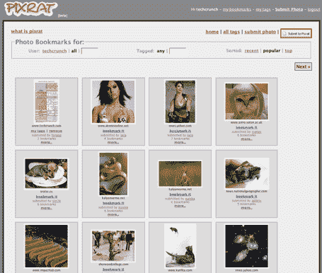

# Pixrat 书签照片 

> 原文：<https://web.archive.org/web/http://www.techcrunch.com:80/2006/04/05/pixrat-bookmarks-photos/>

  总部位于班加罗尔的 [Pixrat](https://web.archive.org/web/20220929081223/http://www.pixrat.com/) ，由三名前雅虎员工创办，名为 **Del.icio.us 供图**。

功能很简单:将他们的书签添加到你的浏览器中，当你在一个有照片的页面上，你想为其中一张照片添加书签时，点击书签并按照步骤选择照片并标记它。照片可以按新近度或流行度排序，也可以按标签搜索。如果你在 Pixrat 上看到一张你喜欢的加了书签的图片，你可以在你的帐户中点击它并添加你自己的标签。

就是这样。很简单。我喜欢这样的东西——如果我在做基于照片的研究，这将是一个非常有用的工具。它需要什么:标签、用户账户、流行和新类别的 RSS 源。为什么它不在那里？

注意[之前的简介](https://web.archive.org/web/20220929081223/http://www.beta.techcrunch.com/2006/02/12/dabble-media-bookmarking-sweetness/) [Dabble](https://web.archive.org/web/20220929081223/http://www.dabble.com/) (媒体文件的书签)说他们也将进入照片领域。更多关于 Pixrat 的信息，来自[乔丹跑步](https://web.archive.org/web/20220929081223/http://www.downloadsquad.com/2006/03/17/pixrat-social-bookmarking-for-photos/)和[皮特·凯什摩尔](https://web.archive.org/web/20220929081223/http://mashable.com/2006/03/20/pixrat-delicious-for-photos/)。Pixrat 博客是[这里](https://web.archive.org/web/20220929081223/http://blog.pixrat.com/)。

