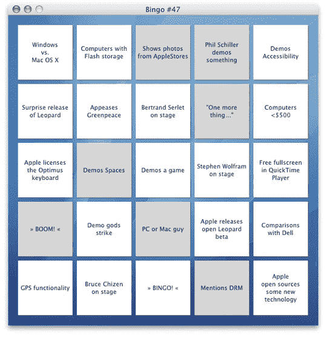

# 玩 WWDC 07 宾果游戏！TechCrunch

> 原文：<https://web.archive.org/web/http://techcrunch.com:80/2007/06/11/play-wwdc-07-bingo/>

# 玩 WWDC 07 宾果游戏！

毫无疑问，今天每个人脑子里想的都是 WWDC。与其做一个传统主义者，坐在那里不停地刷新博客，为什么不享受一个有趣的史蒂夫·乔布斯宾果游戏呢？这个漂亮的 Mac OS X 应用程序有一张宾果卡，上面写满了史蒂夫·J 在 WWDC 的主题演讲中可能会说或不会说或做的事情。你可以选择“展示苹果商店的照片”或者“豹纹的惊喜发布”。第一个得到宾果的人赢！

该应用程序仅适用于 OS X，并有多种语言版本，因此每个人都可以使用。点击下面的官方网站获得完整的游戏细节和下载链接。

[基调宾果](https://web.archive.org/web/20130628193312/http://bingo.keynote.se/)