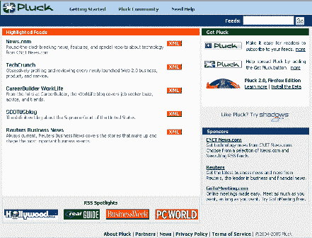

# Pluck 的特色是 TechCrunch Feed

> 原文：<https://web.archive.org/web/http://www.techcrunch.com:80/2005/07/22/pluck-features-the-techcrunch-feed/>

# Pluck 以 TechCrunch Feed 为特色

[puck](https://web.archive.org/web/20210702143901/http://www.pluck.com/)让 TechCrunch 成为今天的“特色供稿”([链接](https://web.archive.org/web/20210702143901/http://client.pluck.com/1.0.0/pie/welcome/))。对于新订户(已经有一大堆——感谢摘下),我们为今天缓慢的评论日道歉。我们仍在从 AlwaysOn 会议中恢复。明天的每周总结将是一个伟大的，虽然，我们有一吨伟大的评论即将到来！

对于那些在市场上寻找最好的 RSS 聚合器的人来说，看看 Pluck 的新 [Firefox 扩展](https://web.archive.org/web/20210702143901/http://www.pluck.com/poxbeta.htm)(我们的[简介](https://web.archive.org/web/20210702143901/http://www.beta.techcrunch.com/?p=89))。还有 [Shadows](https://web.archive.org/web/20210702143901/http://www.shadows.com/) (我们的[个人资料](https://web.archive.org/web/20210702143901/http://www.beta.techcrunch.com/?p=92))，他们全新的书签服务和令人敬畏的 shadow pages 功能绝对是 AlwaysOn 的热门话题。

谢谢你的勇气！

