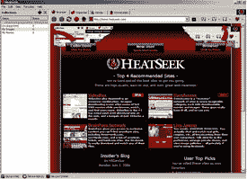
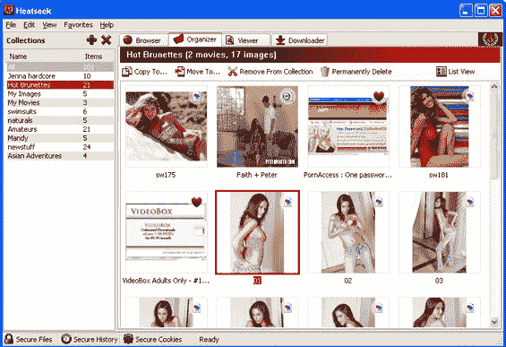
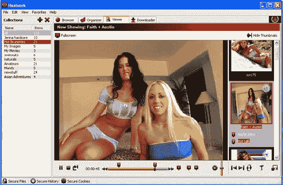

# 色情浏览器热搜发布(是的，色情浏览器)

> 原文：<https://web.archive.org/web/http://www.techcrunch.com/2006707711/porn-browser-heatseek-launches-yeah-porn-browser/>

 [Heatseek](https://web.archive.org/web/20080821205410/http://www.heatseek.com/) 是今天悄然上线的一款色情聚焦浏览器。这个软件的意义在于让色情浏览更高效，更安全。该浏览器仅在 Windows 机器上可用，并且构建在 Internet Explorer 之上。

他们显然已经考虑清楚了。每个功能都旨在让色情消费变得更容易，或者让其他人不太可能知道你在做什么。我将首先浏览一些功能，并把我的社论留到最后。

在安全方面:打开浏览器需要凭证。下载的文件是加密的，只能通过 Heatseek 查看。他们尽最大努力消除弹出窗口、间谍软件和病毒。最后，他们甚至包括一个紧急按钮来立即关闭应用程序。

在易用性方面:可以下载图片和视频，只需点击一下即可完成。如上所述，这些文件是加密的，只能在 Heatseek 中打开。下载的文件可以被组织成播放列表，并且可以通过拖放来重新组织。他们包括了一个书签功能，允许用户快速跳转到他们“最喜欢”的场景(见下面的最后一个截图)。

Heatseek 还保证他们的软件不含间谍软件。

Heatseek 的基本版是免费的，高级版一次性收费 20 美元。高级版的主要特点是，它允许用户解密下载的文件，并将它们直接移动到硬盘上，以便在其他浏览器和媒体播放器中使用。高级版还允许用户访问“特殊内容”。

Heatseek 团队正在努力保持匿名，尽管至少与另一家浏览器初创公司有一点联系——基于 Mozilla 的媒体浏览器 Songbird。Rob Lord 是 Songbird 的创始人，也是 Heatseek 的股东和董事会成员。

潜在用户注意:许多雇主(和配偶)在电脑上安装监控软件，Heatseek 不会绕过这些软件。

这篇文章发表于 2006 年 7 月 11 日星期二下午 4:17，归档在[公司&产品简介](https://web.archive.org/web/20080821205410/http://www.techcrunch.com/category/company-product-profiles/ "View all posts in Company & Product Profiles")下。你可以通过 [RSS 2.0](https://web.archive.org/web/20080821205410/http://www.techcrunch.com/2006/07/11/porn-browser-heatseek-launches-yeah-porn-browser/feed/) feed 关注这个条目的任何回复。评论和 pings 目前都已关闭。