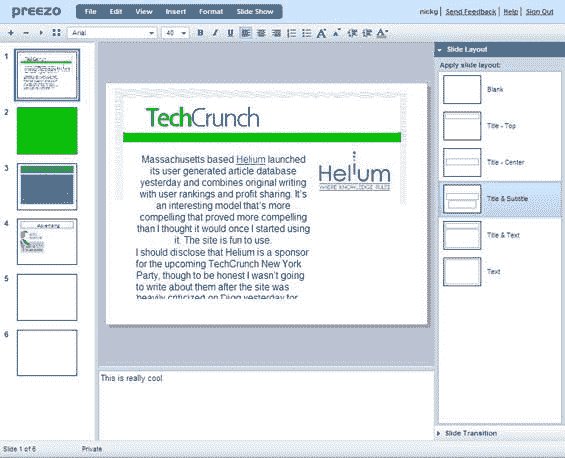

# Preezo 加入在线办公室竞赛 

> 原文：<https://web.archive.org/web/http://www.techcrunch.com:80/2006/10/11/preezo-enters-online-office-race/>

# Preezo 进入网上办公室竞赛

在网上办公竞赛中兴风作浪的不仅仅是谷歌和 [Zoho](https://web.archive.org/web/20220922123818/http://ww.beta.techcrunch.com/tag/zoho) 两家公司。模仿微软办公套件中的一个或多个产品的新创业公司定期推出。Preezo 刚刚推出了他们即将发布的 PowerPoint 克隆版。我们已经跟踪了许多这样的产品，包括 [Zoho](https://web.archive.org/web/20220922123818/http://www.beta.techcrunch.com/2006/06/23/zoho-announces-an-online-power-point-type-tool/) 、 [Empressr](https://web.archive.org/web/20220922123818/http://www.beta.techcrunch.com/2006/07/12/empressr-a-flash-powerpoint-competitor/) 、 [Thumbstacks](https://web.archive.org/web/20220922123818/http://www.beta.techcrunch.com/2006/03/09/thumbstacks-ajaxflash-web-powerpoint/) 。我们还跟踪了一些公司，它们只是在用桌面应用程序创建演示文稿后将其放在网上——我们最喜欢的是 [Slideshare](https://web.archive.org/web/20220922123818/http://www.beta.techcrunch.com/2006/10/04/introducing-slideshare-power-point-youtube/) ，它允许用户将 PowerPoint 演示文稿上传到类似 YouTube 的服务上。

Preezo 很好地克隆了 PowerPoint 界面(见下面的屏幕截图)，并为演示文稿分配了一个永久的 URL。演示文稿也可以嵌入到其他网站。在这一点上，虽然它更多的是一个演示，而不是一个工作产品。只有少数用户被允许测试它，没有上传 PowerPoint 文件的导入功能，也没有创建动画或绘图的工具。这些都是正在开发的功能，但是没有发布时间表。

Preezo 最令人印象深刻的是它是由一个开发者杰森·罗伯茨创造的。考虑到市场上已经存在的众多竞争对手，我不会对杰森迅速加入一家更大的公司感到惊讶。如果是这样的话，杰森刚刚给自己造了一份很棒的简历。

在 Preezo [主页](https://web.archive.org/web/20220922123818/http://preezo.net/)上注册以获得发布通知。或者，更有可能的是，在 Preezo [博客](https://web.archive.org/web/20220922123818/http://blog.preezo.net/)上获得杰森未来就业的消息。

