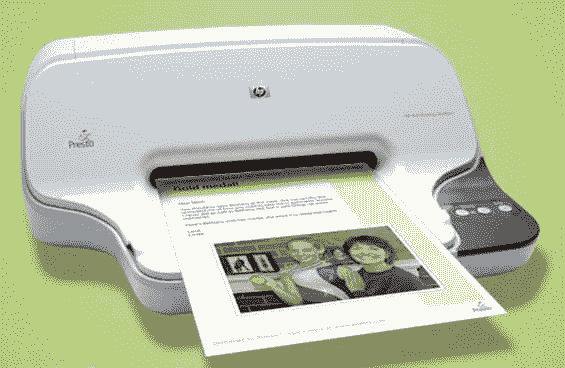

# 很快:因为电脑会吓到老人

> 原文：<https://web.archive.org/web/http://www.techcrunch.com:80/2006/11/27/presto-because-computers-scare-old-people/>

# 因为电脑会吓到老人

  硅谷一家名为 [Presto](https://web.archive.org/web/20220814091757/http://www.presto.com/) 的初创公司悄然推出了一项新服务，其目标人群是目前无法上网，但希望能够接收爱人发来的电子邮件和照片的人。它将惠普公司生产的特殊打印机与通过普通电话线向打印机发送数据的网络服务结合在一起——不需要互联网接入或计算机。

整个 Presto 网站的显著特点是快乐的老人从(年轻的，大概是精通技术的)所爱的人那里收到照片的照片。根据这些无处不在的图片，我的猜测是，老年人是 Presto 服务的目标人群。

玩笑归玩笑，Presto 对某些人(可能是 TechCrunch 读者的父母和祖父母)来说看起来是一个非常酷的服务。这台打印机售价 150 美元。把它从盒子里拿出来，给它通电，接一根普通的电话线。不需要宽带互联网服务。你会被分配一个特殊的@presto.com 电子邮件地址，当有人向该电子邮件地址发送照片或其他内容时，它会在打印机上打印出来。~~老人~~用户简单地把它从打印机上拿下来看看。我们将得到一个打印机和服务的测试版本，并将在实际体验后发布一个更长的评论。

这项服务本身每月还要花费 10 美元，这也是 Presto 赚钱的地方。惠普从人们使用该服务后购买的墨盒中赚钱。

我确实担心垃圾邮件。很有可能垃圾邮件发送者会向%@presto.com 发送大量电子邮件，因为他们知道这些邮件会被打印出来并发送给最终用户。我相信 Presto 会有过滤器来处理大部分这种情况。但我也想知道，随着时间的推移，Presto 向广告商出售向 Presto 用户发送限量“特别优惠”的权利的动机是否会变得太大而不容忽视，或许是为了换取免费或低价账户。我们走着瞧。

普雷斯托得到了凯鹏华盈和 Clearstone Venture Partners 的支持。
 **更新:**我之前就应该这样做，但是我对潜在的垃圾邮件问题做了更多的研究。您必须是打印机接受电子邮件的可接受发件人，这样未经请求的垃圾邮件将不会被打印。然而，要访问用户帐户来接受/拒绝朋友需要一台电脑，所以我猜测如果他们没有电脑，家庭成员或朋友会帮助他们维护帐户。

