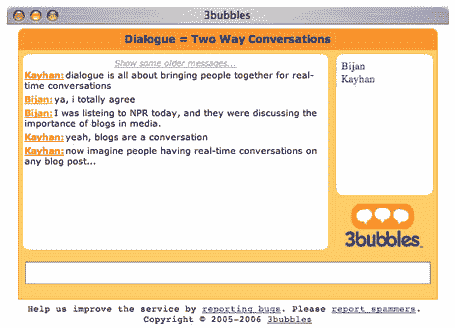

# 3 个气泡的预览

> 原文：<https://web.archive.org/web/http://www.techcrunch.com/2006/02/10/preview-of-3bubbles/http://www.techcrunch.com/2006/02/10/preview-of-3bubbles/>

总部位于硅谷的 [3Bubbles](https://web.archive.org/web/20090108223021/http://www.3bubbles.com/) 将于下周推出，它将成为博客和其他网站扩展他们所写内容的绝佳方式。

他们创建了一个非常容易集成的基于 Ajax 的聊天界面，可以自动添加到每个博客帖子中。只需在博客模板中添加一个代码片段，每篇文章(评论、引用和现在的聊天)都会包含一个链接，打开一个聊天窗口，读者可以在这里辩论和讨论文章。

这项服务最终会将广告整合到 ajax 聊天窗口中，该公司表示，他们将与博客分享收入。或者，博客可以为这项服务支付月费，或者关闭广告，或者保留所有广告收入。

3bubbles 是由 Drew Golkar 和 Jeremie Miller 创建的，并且很幸运地有 Stowe Boyd 作为顾问( [Stowe 今天也在写关于 3bubbles 的文章](https://web.archive.org/web/20090108223021/http://www.stoweboyd.com/message/2006/02/first_glimpse_3.html))。

希望 Jeremie Miller 的参与(他是 Jabber 协议的发明者)将确保 3bubbles 具有足够的可扩展性来处理所有这些分布式流量。一个有点类似的服务，ajchat，在保持服务稳定方面遇到了严重的问题。

3bubbles 将会在博客上大受欢迎。我在 TechCrunch 上加了两次 chat(ajchat 帖子[和 bunchball](https://web.archive.org/web/20090108223021/http://www.techcrunch.com/2005/12/20/ajchat-ajax-instant-messaging-on-the-fly/) 帖子),一个丰富的讨论立即出现了。对于 Memeorandum 和 NewsVine 这样的新闻网站来说，这也是一个绝妙的主意。

在此报名参加[3 bubbles beta](https://web.archive.org/web/20090108223021/http://www.3bubbles.com/)。