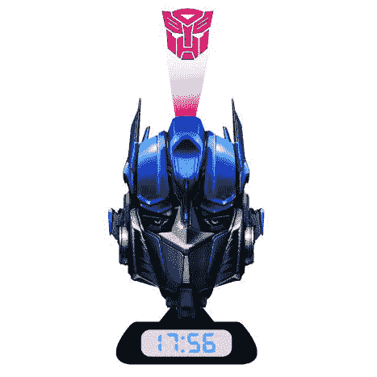

# 黄金时间:变形金刚电影预览版| TechCrunch

> 原文：<https://web.archive.org/web/http://techcrunch.com:80/2007/04/14/prime-time-transformers-movie-merch-preview/>

我们还有几个月就要迎来可能是有史以来最具科幻色彩的电影《变形金刚》的首映式。虽然我们一直在报道这些事件，直到它们被搬上银幕，但让读者感兴趣的是以电影为主题的营销手段。

比如这个擎天柱头像投影闹钟。它是 Op 的头，底部有一个数字读出器。到了该醒来的时候，他告诉你变形并滚出去，同时把汽车人的标志投射到你的天花板或墙上。就为了那个，值得。

美国消费者还没有定价，但我们猜测它会在 40 美元范围内。我们一定会有一个的。

[擎天柱会说话的闹钟【Play.com ](https://web.archive.org/web/20151007141017/http://www.play.com/Gadgets/Gadgets/4-/3348769/Transformers_Optimus_Prime_Projection_Alarm_Clock/Product.html)