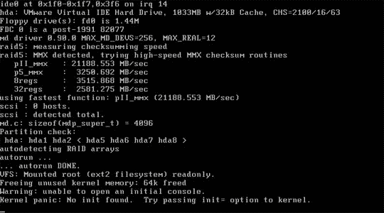

# 教授拥有学生试图拥有| TechCrunch

> 原文：<https://web.archive.org/web/http://techcrunch.com/2007/07/13/professor-owns-student-trying-to-own/>

IT 工具箱里有一个很棒的故事，讲的是一个教授和他的一个幼稚的青少年学生。绰号“Pima”(因为他是一个讨厌鬼)，这个学生会偷懒，通过更改 root 密码假装成 uber-l337，在课堂上争论观点——你知道，诸如此类的事情。因为所有学生的电脑都是从班上的一台中央电脑启动的，所以当教授发现 root 被更改时，他变得很好奇。

好奇心最终导致猫变得淘气。他用麦克风录制了一些精选的声音文件，编写了一个脚本来播放它们，并将计算机的扬声器音量设置为 75%。为了确保这个小屁孩会被纠正过来，他甚至用一把小刀撬开了音量按钮！

舞台已经搭好了。皮马坐了下来，脸上挂着吃大便的笑容。几分钟后，三个独立的文件间隔播放:

> -“你不应该改变我的根密码男孩！”
> ——“我的驼峰！我的驼峰！我小小的驼峰！”
> ——“立正上课。这就是当你 DONT 注意到教师，改变你的根密码，并完全无视你的工作。仅此而已。”

不用说，皮马现在行动一致，提前 5 分钟到教室。千万不要惹你的 CS 老师。*曾经的*。

我在你的电子信箱里修改你的密码