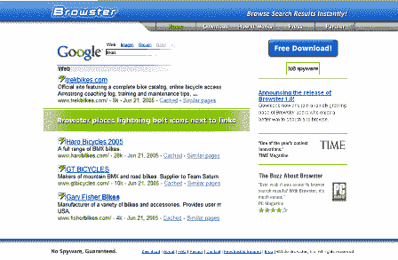
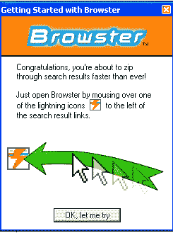
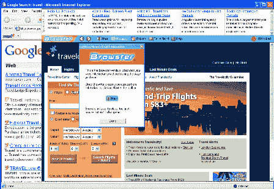
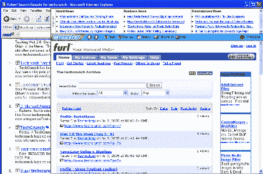

# 个人资料–浏览器–TechCrunch

> 原文：<https://web.archive.org/web/http://www.techcrunch.com:80/2005/07/13/profile-browster/>

**公司:** [浏览器](https://web.archive.org/web/20210609060957/http://www.browster.com/)

**推出日期:**2005 年 2 月测试版，今天推出 1.0 版本，[2005 年 7 月 13 日](https://web.archive.org/web/20210609060957/http://www.browster.com/pr_071305.htm)

**什么事？**

Browster 是一个工具，仅适用于 IE (该死，我刚刚失去了一半的读者)，它从网页上的链接中预取内容，并通过将鼠标悬停在链接上来提供这些内容。太直观了点击[此处](https://web.archive.org/web/20210609060957/http://www.browster.com/how_it_works.htm)。

所以我们重新使用 IE 浏览器(目前只用于 FTP)，下载了 334k 的内容并开始使用。

Browster 允许您更快地浏览搜索结果，并且点击次数更少。如果你要求的话，Browster 还会从非搜索网站预取内容(有几种简单的方法可以做到这一点)。

有一个很好的功能，基本上可以通过点击一个箭头来快速滚动搜索结果。这很难解释，但效果很好。

Browster 的窗口顶部有 CPC 广告。我不介意广告，但他们展示的内容的版权所有者可能会介意。我也希望他们在 IE 之前关注 Firefox……即使 IE 仍然有很大的市场份额，看起来大多数尖端用户都在使用 Firefox 或 MAC。不支持这些浏览器是一个严重的错误，因为你最重要的客户(比如博客)不会使用它。

Tom Foremski [几小时前写了关于 Browster](https://web.archive.org/web/20210609060957/http://www.siliconvalleywatcher.com/mt/archives/2005/07/browsteraa_nift_1.php) 的文章，指出了一些非常严重的缺陷(我们同意一些，不同意另一些)。最终，我们真正关心的是上面提到的那些问题(浏览器支持和版权侵犯问题)。从商业模式的角度来看，这个产品很少有病毒或者粘性。这意味着，最终他们的流动性事件估值可能是基于他们的技术，而不是他们的网络。

这是一个很棒的工具，只要他们支持 firefox，我就会经常使用它。

**附加屏幕截图:**

**管理团队:**

Scott Milener，首席执行官兼联合创始人
吉姆·凯利，工程副总裁
Steven Lurie，业务发展副总裁
Wendell Brown，董事长兼联合创始人
John Zeisler，董事会成员
[链接](https://web.archive.org/web/20210609060957/http://www.browster.com/management.htm)

**投资者:**

首轮资本
联合创始人兼董事会成员温德尔·布朗
风险投资合伙人约翰·泽斯勒
董事总经理肯·索耶
门罗风险投资公司前普通合伙人里克·马格努森
阿尔塔合伙人
普通合伙人罗伯特·西蒙[链接](https://web.archive.org/web/20210609060957/http://www.browster.com/investors.htm)

**相关链接:**

[工作原理](https://web.archive.org/web/20210609060957/http://www.browster.com/how_it_works.htm)
[常见问题](https://web.archive.org/web/20210609060957/http://www.browster.com/faq.htm)
[按下](https://web.archive.org/web/20210609060957/http://www.browster.com/press.htm)
[关于](https://web.archive.org/web/20210609060957/http://www.browster.com/about.htm)
[投资人](https://web.archive.org/web/20210609060957/http://www.browster.com/investors.htm)
[管理人](https://web.archive.org/web/20210609060957/http://www.browster.com/management.htm)
[斯科特·米莱纳(创始人)博客](https://web.archive.org/web/20210609060957/http://browster.typepad.com/scott_milener_blog/)

标签:[浏览器](https://web.archive.org/web/20210609060957/http://www.technorati.com/tags/browster)，[搜索](https://web.archive.org/web/20210609060957/http://www.technorati.com/tags/search)， [techcrunch](https://web.archive.org/web/20210609060957/http://www.technorati.com/tags/techcrunch) ， [web2.0](https://web.archive.org/web/20210609060957/http://www.technorati.com/tags/web2.0) ，[个人资料](https://web.archive.org/web/20210609060957/http://www.technorati.com/tags/profiles)，[评论](https://web.archive.org/web/20210609060957/http://www.technorati.com/tags/reviews)， [InternetExplorer](https://web.archive.org/web/20210609060957/http://www.technorati.com/tags/InternetExplorer)