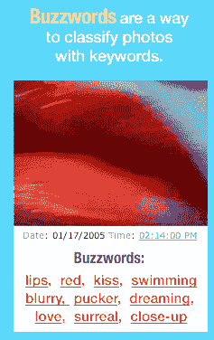
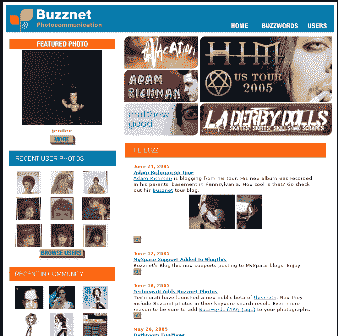

# 简介:BuzzNet

> 原文：<https://web.archive.org/web/http://www.techcrunch.com:80/2005/06/23/profile-buzznet/>

**公司:** [BuzzNet](https://web.archive.org/web/20220812092657/http://www.buzznet.com/)

**成立:【2003 年 3 月**

**地点:**

Buzznet，Inc.
加利福尼亚州洛杉矶威尔希尔大道 2404 号 11b
邮编 90057
(213) 252-8999 电话
(213) 252-8955 传真

**什么事？**

BuzzNet 是一个照片分享社区。如果不把 BuzzNet 和 Flickr 进行比较和对比，很难谈论 BuzzNet。它分享了 Flickr 的大部分或全部优势，同时也有一些额外的特性。在我看来，正是这些额外的功能让它变得更好，无论是对于休闲和/或“移动”用户，还是寻找分享他们作品的方式的严肃摄影师。我会在下面解释原因。

第一，基础。你可以在这里快速浏览一下，看看它是如何工作的。注册一个免费的 BuzzNet 帐户，您可以将照片直接上传到他们的网站，或者使用包含您选择的关键字的唯一电子邮件地址发送照片。这使得移动照片博客变得简单——只需用手机拍一张照片，几秒钟内就可以上传到你的照片博客上。

你和其他任何人都可以给图片添加标签(他们称之为“流行语”)(Flickr 只允许你和你的朋友添加标签)。用户可以通过这些标签进行搜索/浏览，它们也在 technorati 上进行索引，并显示缩略图，以便 Technorati 对这些标签进行搜索。例如，在“西雅图”上搜索 [technorati 标签](https://web.archive.org/web/20220812092657/http://www.technorati.com/tag/seattle)并查看右边的 BuzzNet 和 Flickr 照片。

每个用户都有自己的图片、评论和个人资料的唯一网址。你可以在 techcrunch.buzznet.com 的[看到 Techcrunch 的照片博客。对于更酷的照片博客，请查看](https://web.archive.org/web/20220812092657/http://techcrunch.buzznet.com/user/)[主页](https://web.archive.org/web/20220812092657/http://www.buzznet.com/)上的一些精选照片。例如，一个叫亚当·里奇曼的家伙，在宾夕法尼亚州他父母的地下室录制了一张专辑，在巡回演出的时候，他在博客上拍照。[链接](https://web.archive.org/web/20220812092657/http://adamrichman.buzznet.com/user/)

上传图片很容易，这是我比 Flickr 更喜欢的部分:BuzzNet 没有限制上传容量(Flickr 每月 20 兆)，而是限制每月可以上传的照片总数(在免费帐户上刚刚从 60 增加到 120)。为什么这很重要？原因如下——在 Flickr 上，我必须花时间调整照片的大小，这样我就不会因为十张 2 mb 的照片而立即用完每月的配额。在 BuzzNet，我只需发送大文件，他们就会为我调整大小。一个鲜为人知的事实(联合创始人兼总裁马克·布朗告诉我的)是，BuzzNet 为我存储了原始的全尺寸图像，这是一个针对严肃摄影师的杀手级存档工具，它将允许他们在未来提供高质量的打印服务(只需点击一个按钮，他们就可以创建一个装订的相册并发送给你)。

BuzzNet 似乎比 Flickr 有更多关于照片的“讨论”。Marc 告诉我，在那些有评论的照片中，平均有 5 条评论，高于 Flickr。由于 BuzzNet 比 Flickr 有更深层次的用户特征，很明显会有更多的社交网络出现。

**附加功能:**

–轻松发布
–每个用户的唯一网址
–每个用户页面的 RSS 订阅源
–评论图片(带用户设置)
–轻松标记
–大量免费帐户功能–每月 120 张照片
–轻松邀请朋友加入
–邀请三位朋友加入，他们会将您的帐户升级为一整年的高级订阅
–好友列表
–引用通知(谁链接到您)
–书签(Buzznet 上您最喜爱的照片)
–最喜爱的社区和流行语/标签
–私人信息——如基于网络的电子邮件
–定制设计模板
–分享照片:通过电子邮件将照片发送给朋友
–统计数据:页面浏览量和其他统计数据

**附加屏幕截图:**

**管理:**

马克·布朗——联合创始人、总裁
安东尼·巴特——联合创始人
史蒂夫·霍尔丹——技术总监
里奇·李——艺术总监

**相关链接:**

[关于](https://web.archive.org/web/20220812092657/http://www.buzznet.com/www/about.php)
[出版社、媒体](https://web.archive.org/web/20220812092657/http://www.buzznetinc.com/)
[企业网站](https://web.archive.org/web/20220812092657/http://www.buzznet-inc.com/)
[常见问题解答](https://web.archive.org/web/20220812092657/http://www.buzznet.com/www/faq.php)
[关于 Technorati 添加 Buzznet 图片](https://web.archive.org/web/20220812092657/http://www1.buzznet.com/blogs/buzznet/archives/2005/06/technorati_adds.html)
[Technorati 标签:BuzzNet](https://web.archive.org/web/20220812092657/http://www.technorati.com/tag/buzznet)
[BuzzNet 上的 Bitsplitter v . Flickr](https://web.archive.org/web/20220812092657/http://www.bitsplitter.net/blog/?p=480)
[Om Malik 关于 buzznet](https://web.archive.org/web/20220812092657/http://www.gigaom.com/2005/03/20/flickr-oo/)
[Furl 搜索关于 BuzzNet](//web.archive.org/web/20220812092657/https://www.furl.net/search?enc=UTF-8&chn=front&search=true&keyword=buzznet&src=7)

标签: [buzznet](https://web.archive.org/web/20220812092657/http://www.technorati.com/tag/%20buzznet) ， [flickr](https://web.archive.org/web/20220812092657/http://www.technorati.com/tag/flickr) ， [web2.0](https://web.archive.org/web/20220812092657/http://www.technorati.com/tag/web2.0) ， [techcrunch](https://web.archive.org/web/20220812092657/http://www.technorati.com/tag/techcrunch) ，[照片](https://web.archive.org/web/20220812092657/http://www.technorati.com/tag/photos)，[摄影博客](https://web.archive.org/web/20220812092657/http://www.technorati.com/tag/photoblogging)