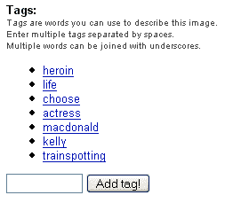
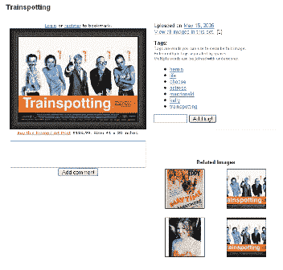
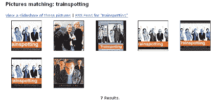

# 简介:名人闪烁 TechCrunch

> 原文：<https://web.archive.org/web/http://www.techcrunch.com/2005/06/27/profile-celebrity-flicker/>

**公司:** [名人忽悠](https://web.archive.org/web/20230131085023/http://www.celebrityflicker.com/) 

发布日期:【2005 年 5 月

**什么事？**

名人闪烁是一个张贴名人照片和相关图像(电影艺术等)的网站。).这个网站不太深入，似乎专注于衣着不太暴露的女性，所以它不是 imdb.com 的替代品。然而，它有一个有趣的特性使其与 web 2.0 相关——用户匿名标记。

当您查看特定图片时，用户添加的标签会出现在图片旁边，并带有“添加标签！”按钮:

[链接](https://web.archive.org/web/20230131085023/http://www.celebrityflicker.com/index.php/photo/1594)

这是有意义的，因为这是匿名用户标记网站内容的第一次实验，目的是将一段内容与其他内容联系起来。在上面的屏幕截图中，猜火车图片旁边的用户生成的标签是:

*海洛因
*生活
*选择
*女演员
*麦克唐纳
*凯莉
*猜火车

这些标签中的每一个都链接到由其他用户同样标记的其他图片。这意味着该网站正在利用其用户使其内容更容易被找到。例如，如果你点击“猜火车”链接，你会看到这个页面:

[链接](https://web.archive.org/web/20230131085023/http://www.celebrityflicker.com/index.php?section=photo&action=tags&tag=trainspotting)

尽管大多数结果都不如这个相关。用户标记的一个大问题是产生真实的无用的结果。我们将在最近发布的 Feedster 匿名标签功能的文章中写更多的内容。

有了 Delicious，用户就有了真正的动力来正确标记——这样他们就可以通过搜索或浏览他们的标记来再次找到内容。有了名人效应，这种激励就明显变得不那么有力了，因此结果也就不那么重要了。
 **这证明了什么？**

这意味着，如果一个 web 2.0 服务要添加用户标签，特别是*匿名*用户标签，他们最好为用户提供一个好的激励。)否则他们会得到错误的数据。

**发布者标签怎么样？**

出版商标签是一种不同的动物。作为发布者标签的一个例子，请看我们在这篇文章最后添加的标签。这有助于 technorati、pubub、feedster 等实时搜索引擎以上下文相关的方式快速索引帖子，并将其与类似内容相关联(这是出版商想要的，因此他们有动力去做并正确地做)。此外，下面的链接允许本帖的读者点击(在我们的例子中是 technorati)来查看类似标记的内容，如果他们对主题感兴趣的话。

然而，出版商也有“垃圾邮件”的动机，这是出版商标记的一个问题。

**链接:**

[斯科特·拉夫](https://web.archive.org/web/20230131085023/http://corp.feedster.com/blog/rafer/archives/2005/05/anonymous_taggi_1.html)
[电子调解员](https://web.archive.org/web/20230131085023/http://e-mediate.squarespace.com/the-e-mediator-blog/2005/5/20/anonymous_-inclusive_tagging.html)
[businesspundit.com](https://web.archive.org/web/20230131085023/http://www.businesspundit.com/archives/002072.ht)
[英国广播公司用匿名用户标记进行实验](https://web.archive.org/web/20230131085023/http://backstage.bbc.co.uk/prototypes/archives/2005/05/bbc_shared_tags.html)

标签: [celebrityflicker](https://web.archive.org/web/20230131085023/http://www.technorati.com/tag/celebrityflicker) ，[标签](https://web.archive.org/web/20230131085023/http://www.technorati.com/tag/tags)， [web2.0](https://web.archive.org/web/20230131085023/http://www.technorati.com/tag/web2.0) ， [techcrunch](https://web.archive.org/web/20230131085023/http://www.technorati.com/tag/techcrunch) ，[标签](https://web.archive.org/web/20230131085023/http://www.technorati.com/tag/tagging)，[匿名标签](https://web.archive.org/web/20230131085023/http://www.technorati.com/tag/anonymoustagging)