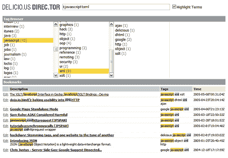

# 简介:del . icio . us director 

> 原文：<https://web.archive.org/web/http://www.techcrunch.com:80/2005/06/26/profile-delicious-director/>

**服务:** [美国导演](https://web.archive.org/web/20150924130342/http://johnvey.com/features/deliciousdirector/)

**投放:**2005 年 6 月 22 日

**什么事？**

del.icio.us direc.tor 是一个 Ajax 客户端 bookmarklet 应用程序，用 [LifeHacker](https://web.archive.org/web/20150924130342/http://www.lifehacker.com/software/productivity/delicious-on-crack-delicious-director-109934.php) ，*的话说，“将 del.icio.us 书签服务变成了一个华丽、生动、动态的应用程序，几乎让我目瞪口呆。”*

从网站:

*“它利用现代浏览器的 XML 和 XSL 服务，为管理具有大量记录的用户帐户提供一个响应迅速的界面。*

*主要功能有:*

**浏览器内处理 del.icio.us 书签(测试多达 12，000 条记录)
*使用基本搜索操作符搜索所有书签
*按描述、标签或时间戳排序
*特设标签浏览器* [链接](https://web.archive.org/web/20150924130342/http://johnvey.com/features/deliciousdirector/)

它易于安装，是 Delicious 的一个很好的界面。

**应用程序截图:**

**创作人:**黄宗宪
 **相关链接:**

[静态演示](https://web.archive.org/web/20150924130342/http://johnvey.com/features/deliciousdirector/demo.html) [博客条目宣布](https://web.archive.org/web/20150924130342/http://johnvey.com/blog/2005/06/delicious-director#comments) [life hacker on this](https://web.archive.org/web/20150924130342/http://www.lifehacker.com/software/productivity/delicious-on-crack-delicious-director-109934.php)
[Marshall ' s Web Tool on this](https://web.archive.org/web/20150924130342/http://marshallk.blogspot.com/2005/06/softening-interface-rss-and-delicious.html)
[Jeremy Zawodny](https://web.archive.org/web/20150924130342/http://jeremy.zawodny.com/blog/archives/004889.html)

标签:[好吃的](https://web.archive.org/web/20150924130342/http://www.technorati.com/tag/delicious)， [del.icio.us](https://web.archive.org/web/20150924130342/http://www.technorati.com/tag/del.icio.us) ，[好吃的导演](https://web.archive.org/web/20150924130342/http://www.technorati.com/tag/deliciousdirector)， [web2.0](https://web.archive.org/web/20150924130342/http://www.technorati.com/tag/web2.0) ， [techcrunch](https://web.archive.org/web/20150924130342/http://www.technorati.com/tag/techcrunch) ，[导演](https://web.archive.org/web/20150924130342/http://www.technorati.com/tag/direc.tor)