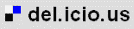
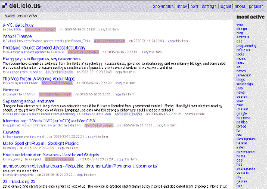
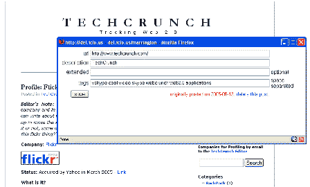

# 简介:Del.icio.us 

> 原文：<https://web.archive.org/web/http://www.techcrunch.com:80/2005/06/16/profile-delicious/>

**公司:**

**发布日期:【2004 年初**

**融资:**2005 年 4 月初，联合广场风险投资公司、Amazon.com、马克·安德森、BV Capital、埃丝特·戴森、塞思·戈尔茨坦、乔希·科佩尔曼、霍华德·摩根、蒂姆·奥雷利和鲍勃·扬提供了种子资金(据传闻为 200 万美元)。

**什么事？**

Deli.cio.us 也是定义 web 2.0 应用程序之一。它是由约书亚·沙赫特创造的。

美味使标签流行起来。

这是一个带有标签的开放书签服务。您可以标记您的书签(任何 URI，意味着一个网页或一篇博客文章)，这有助于您组织数据。delicious 特别酷的一点是，你可以查看其他人以多种不同方式标记的数据。

你可以在浏览器中添加一些工具，等等。在你看 URIs 的时候给它们贴上标签。下面的第二个屏幕截图展示了这一点

比如说。[deli.cio.us/marrington](https://web.archive.org/web/20230307213242/http://del.icio.us/marrington)展示了我创建的所有美味标签。同样，[del.icio.us/joshua](https://web.archive.org/web/20230307213242/http://del.icio.us/joshua)展示了创始人乔希·沙赫特创建的所有标签。

您还可以通过标签查看数据。[del.icio.us/techcrunch](https://web.archive.org/web/20230307213242/http://del.icio.us/tag/techcrunch)显示用户添加的所有 techcrunch 标签。将 URL 中的“techcrunch”替换为其他内容，然后查看结果。您还可以在 del.icio.us/popular[查看热门标签。诸如此类。](https://web.archive.org/web/20230307213242/http://del.icio.us/popular/)

RSS 提要可用于任何搜索/浏览字符串，因此监控新标签很容易。

每天，人们都在寻找使用美味的新方法。

用他们自己的话说，*“del . icio . us 是一个社交书签管理器。它允许您轻松地将您喜欢的站点添加到您的个人链接集合中，使用关键字对这些站点进行分类，并且不仅在您自己的浏览器和机器之间共享您的集合，还可以与其他人共享。一旦你注册了这项服务，你就可以在你的浏览器中添加一个简单的书签(见下文)。当您找到想要添加到列表中的网页时，您只需选择 del.icio.us bookmarklet，系统会提示您输入关于该页面的信息。您可以添加描述性术语以将相似的链接组合在一起，修改页面标题，并为自己或他人添加扩展注释。您可以从任何 web 浏览器访问您的链接列表。默认情况下，您的链接会按时间倒序显示，您最近添加的链接会显示在顶部。除了按日期查看之外，您还可以查看特定类别中的所有链接(您可以在添加链接时定义自己的类别)，或者在链接中搜索关键字。del.icio.us 之所以成为一个社交系统，是因为它能够让你看到其他人收集的链接，并向你显示还有谁在某个特定的网站上加了书签。您还可以查看其他人收集的链接，并订阅您感兴趣的人的链接。”*

我经常参考 delicious 来查找我已经收藏的页面。我的标签的完整列表总是显示在页面的右边。

**截屏:**

**管理:**

约书亚·沙赫特(创始人)

**相关链接:**

[关于好吃的](https://web.archive.org/web/20230307213242/http://del.icio.us/doc/about)
[好吃的博客](https://web.archive.org/web/20230307213242/http://blog.del.icio.us/)
[Technorati Tag:好吃的](https://web.archive.org/web/20230307213242/http://www.technorati.com/tag/delicious)
[Deli.cio.us tag:好吃的](https://web.archive.org/web/20230307213242/http://del.icio.us/tag/delicious)
[扩展好吃的伟大工具](https://web.archive.org/web/20230307213242/http://elamb.blogharbor.com/blog/_archives/2005/6/16/946671.html)
[快速在线提示——完整的好吃工具集](https://web.archive.org/web/20230307213242/http://pchere.blogspot.com/2005/02/absolutely-delicious-complete-tool.html)(定期更新)
[好吃的好东西](https://web.archive.org/web/20230307213242/http://goodstuff.blogsome.com/2005/06/13/even-more-delicious/)(关于新服务器)
[Niall Kennedy 关于好吃的](https://web.archive.org/web/20230307213242/http://www.niallkennedy.com/blog/archives/2005/06/delicious_tags.html)(关于按媒体类型标记) 如 MP3 文件或 MPEG 电影)
[Om Malik on Delicious Seed Raise](https://web.archive.org/web/20230307213242/http://www.gigaom.com/2005/04/10/delicious-dollars/)
[软件 Only on Delicious Funding](https://web.archive.org/web/20230307213242/http://softtechvc.blogs.com/software_only/2005/04/delicious_close.html)
[采访约书亚·沙赫特](https://web.archive.org/web/20230307213242/http://www.randsinrepose.com/archives/2004/12/03/a_delicious_interview.html)
[弗雷德·威尔逊 on 他对 Delicious 的投资](https://web.archive.org/web/20230307213242/http://avc.blogs.com/a_vc/2005/04/delicious.html)