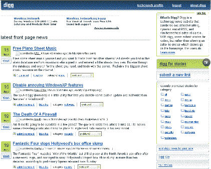

# 简介–Digg 2.0

> 原文：<https://web.archive.org/web/http://www.techcrunch.com:80/2005/07/11/profile-digg-2o/>

**公司:** [Digg](https://web.archive.org/web/20201201093602/http://www.digg.com/)

 **上一篇简介:**[2005 年 6 月 18 日](https://web.archive.org/web/20201201093602/http://www.beta.techcrunch.com/?p=29)

Digg 2.0 发布时间:5 小时前(2005 年 7 月 10 日)

**什么事？**

参见我们之前在 Digg 上的简介,了解其功能描述。这是一个非常有用的新闻网站，它利用用户提交和故事的“挖掘”来提升内容在各种类别和主页中的位置。

Digg 几个小时前发布了 2.0 版本。新的外观和感觉以及扩展的功能。

用他们自己的话说，*“大量的新功能，也有一些 bug:)请点击右下角的“报告网站 bug”提交您发现的任何 bug。我们会尽最大努力尽快修好它们。谢谢，请享用！(注:极简设计在 v2.1 到来)ì"*[链接](https://web.archive.org/web/20201201093602/http://digg.com/digg_news/Welcome_to_digg_2.0)

我们注意到的一个很好的特性是可以在你自己的主页上添加 Digg 故事——很酷的小部件。[链接](https://web.archive.org/web/20201201093602/http://www.digg.com/jshomepageedit)

**链接:**

[Digg](https://web.archive.org/web/20201201093602/http://www.digg.com/)
[欢迎来到 Digg 2.0](https://web.archive.org/web/20201201093602/http://digg.com/digg_news/Welcome_to_digg_2.0)
[Xtremdav45 的博客](https://web.archive.org/web/20201201093602/http://xtremdav45.f2o.org/weblog/)
[Grevs Dev 博客](https://web.archive.org/web/20201201093602/http://dev.grevs.com/2005/07/10/digg-20-2/)
[Jaredm](https://web.archive.org/web/20201201093602/http://www.staticbreeze.com/jaredm/wordpress/2005/07/10/welcome-to-digg-20/)
[Krenken.com](https://web.archive.org/web/20201201093602/http://www.krenken.com/)
[Eric 的博客](https://web.archive.org/web/20201201093602/http://planetxen.com/blog/?p=32)
[phoenix realm](https://web.archive.org/web/20201201093602/http://phoenixrealm.com/2005/07/10/digg-20-is-live/)
[Jake Jarvis](https://web.archive.org/web/20201201093602/http://www.jakejarvis.com/?p=301)(很棒的帖子)(注意 Jake 的

标签: [digg](https://web.archive.org/web/20201201093602/http://www.technorati.com/tags/digg) ， [digg2.0](https://web.archive.org/web/20201201093602/http://www.technorati.com/tags/digg2.0) ， [slashdot](https://web.archive.org/web/20201201093602/http://www.technorati.com/tags/slashdot) ， [web2.0](https://web.archive.org/web/20201201093602/http://www.technorati.com/tags/web2.0) ，[新闻](https://web.archive.org/web/20201201093602/http://www.technorati.com/tags/news)，[标签](https://web.archive.org/web/20201201093602/http://www.technorati.com/tags/tags)，[标签](https://web.archive.org/web/20201201093602/http://www.technorati.com/tags/tagging)， [techcrunch](https://web.archive.org/web/20201201093602/http://www.technorati.com/tags/techcrunch) ， [web2.0](https://web.archive.org/web/20201201093602/http://www.technorati.com/tags/web2.0)