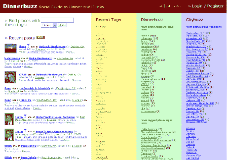
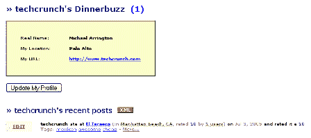
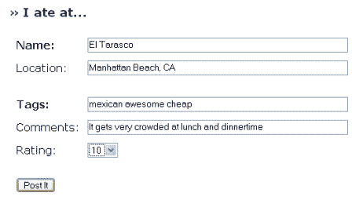
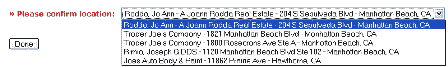

# 简介:dinner buzz TechCrunch

> 原文：<https://web.archive.org/web/http://www.techcrunch.com:80/2005/07/03/profile-dinnerbuzz/>

**公司:** [晚餐嗡嗡声](https://web.archive.org/web/20230131044701/http://www.dinnerbuzz.com/)

**发布日期:【2005 年 6 月**

**什么事？**

Dinnerbuzz 是一项新服务，允许用户提供对餐馆、酒吧和咖啡店的反馈。它利用用户提供的元数据(包括标签)让其他人可以轻松地找到和阅读餐馆的内容。

用他们自己的话说，*“dinner buzz 旨在让你更容易找到吃饭(和饮料)(或咖啡)的地方。这是餐馆、酒吧和咖啡店的社交指南。当您发布时，您的标签将与所有人共享。标签使你很容易找到你以前可能不知道的地方。由于 Dinnerbuzz 使您能够在本地过滤标签，找到有趣的地方(和人)从未如此之快！”*链接[链接](https://web.archive.org/web/20230131044701/http://www.dinnerbuzz.com/about.php)

因此，Dinnerbuzz 是一个新的社交网站，它利用了用户标签。

*切线开始…*

我们注意到 web 2.0 领域的两个新兴趋势。

第一个趋势是新的社交网络/标签服务的大量涌现，用户很难跟上。第二个趋势是用户标签的“问题”。

关于第一个趋势，我们都一直在思考，约翰·巴特利在最近的[帖子](https://web.archive.org/web/20230131044701/http://battellemedia.com/archives/001668.php)(之前在这里讨论过)——*“不断创建社交网络、维护群组、标记、分享等是一件痛苦的事情。我不确定大众是否会养成这种习惯，至少是在纯粹无私的驱使下。”*

第二个趋势是用户标签的“问题”。人们需要激励，否则他们就不会这么做(见我们在 [CelebrityFlicker](https://web.archive.org/web/20230131044701/http://techcrunch.com/?p=51) 和[feedster](https://web.archive.org/web/20230131044701/http://techcrunch.com/?cat=42)–*上的简介)“如果一个 web 2.0 服务要添加用户标签，尤其是匿名用户标签，他们最好能为用户提供一个很好的激励(见 Delicious，Furl 等)。)否则他们会得到错误的数据。”*)

随着时间的推移，这些功能会自行解决，会有赢家和输家，但考虑添加这些功能或以这些功能为基础的新公司需要向前看，否则可能会成为输家。

回到正餐 buzz:用户标签有激励吗？我们拭目以待。

*…切线端*

**读者体验:**

任何人都可以在 Dinnerbuzz 上搜索餐厅并阅读评论。有很多很棒的搜索选项。每个城市都有一个设置页面，从那里可以通过标签(如“墨西哥”)和/或评级(最多 10)进行搜索。一旦在一个城市中有足够数量的餐馆被评级，这可能是搜索好的新餐馆的非常有用的方法。

从监控一个城市、一家餐馆或用户的评论，到阅读新的评论，RSS feeds 无所不包。例如，你可以在这里看到我们的简介和评论(我们真的真的很喜欢曼哈顿海滩的[El Tarasco](https://web.archive.org/web/20230131044701/http://www.dinnerbuzz.com/place.php?145)——我正在试图找出一个角度，我可以称之为“web 2.0”，并在这里介绍它:-))在页面的中间有一个巨大的 XML 按钮。这一切都做得很好。

**发布者体验:**

一旦你注册(简单，没有验证码或电子邮件验证)，你可以张贴自己的评论。第一步是输入餐馆名称和位置。Dinnerbuzz 使用雅虎地图 [api](https://web.archive.org/web/20230131044701/http://developer.yahoo.net/search/local/V1/localSearch.html) 进行本地搜索。

提交餐厅包括输入其名称和位置、添加标签和评论(自由文本)以及从 1 到 10 进行评分:

如果 Dinnerbuzz 找不到适合你的餐厅的完美搭配，它会推荐几个相近的搭配。如果没有相近的匹配，可以选择添加一个位置。

总的来说，添加和检查餐厅对于美国的位置来说是一个很好的体验，但是有两个问题(一个很容易解决)。首先，选项包括所有雅虎本地搜索选项，所以你会看到房地产经纪人、水管工、牙医等。对于相近的匹配(不知道这在 Yahoo api 约束下是否是“可修复的”)。第二，如果有接近的匹配，没有“添加”按钮，如果其中一个匹配是不正确的(很容易添加)。

**主要特点:**

–与雅虎本地数据高度集成
–通过标签、评级或标签+评级进行搜索
–每个城市都有一个城市页面，用户可以通过标签和/或评级进行排序
–轻松提交新位置
–如果与雅虎本地不匹配，出版商可以添加新位置
–RSS 无处不在(耶！)

**需要的修复/功能:**

–能够添加或删除条目
–当有相近匹配时(不仅仅是没有匹配)扩展“添加”功能
–添加朋友并查看/订阅他们的评论
–修复相近匹配中的非餐厅数据

Dinnerbuzz 是一个很酷的实验，它的大多数明显缺陷很容易修复(他们正在增加功能)，如果他们能把它与其他社交网络服务结合起来，随着时间的推移，它可能会成为一个非常有用的服务。

**链接:**

[站点](https://web.archive.org/web/20230131044701/http://www.dinnerbuzz.com/)
[关于](https://web.archive.org/web/20230131044701/http://www.dinnerbuzz.com/about.php)
[标签云](https://web.archive.org/web/20230131044701/http://www.dinnerbuzz.com/tags.php)
[没错](https://web.archive.org/web/20230131044701/http://tagsonomy.com/index.php/yummy-and-yummier/) ( *现在看起来可能没那么重要，但一旦我们开始围绕标签订阅构建我们所有的日常信息工具，生活将会变得简单得多。“* )
[迷失的男孩](https://web.archive.org/web/20230131044701/http://www.ldodds.com/blog/archives/000222.html) ( *)我想知道我们还有多长时间才能达到临界点，在这个临界点上，建立新的社交内容网站比从零开始建立一个社区更具成本效益，也更容易，类似于这些努力，从已经在网络上发布的数据来看。就我个人而言，我不认为我们真的离得那么远。”*)
[John Resig](https://web.archive.org/web/20230131044701/http://ejohn.org/blog/dinnerbuzz-review/)(*“我认为这项服务有很大的潜力，到处都有 RSS，这很好，因为我一直在寻找某种方式将我最新的用餐体验整合到一个 feed 中”*)

标签: [dinnerbuzz](https://web.archive.org/web/20230131044701/http://www.technorati.com/tags/dinnerbuzz) ，[点评](https://web.archive.org/web/20230131044701/http://www.technorati.com/tags/reviews)，[餐厅](https://web.archive.org/web/20230131044701/http://www.technorati.com/tags/restaurants)， [web2.0](https://web.archive.org/web/20230131044701/http://www.technorati.com/tags/web2.0) ， [techcrunch](https://web.archive.org/web/20230131044701/http://www.technorati.com/tags/techcrunch) ，[标签](https://web.archive.org/web/20230131044701/http://www.technorati.com/tags/tags)，[标签](https://web.archive.org/web/20230131044701/http://www.technorati.com/tags/tagging)