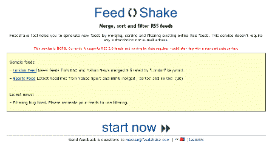
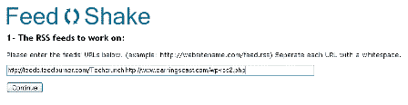
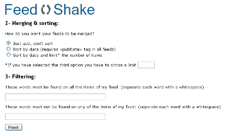
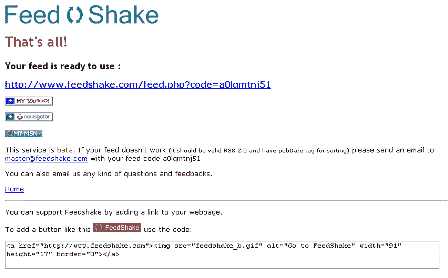

# 简介-feed shake TechCrunch

> 原文：<https://web.archive.org/web/http://www.techcrunch.com:80/2005/07/24/profile-feedshake/>

**公司:** [FeedShake](https://web.archive.org/web/20221129073153/http://www.feedshake.com/)

 **发射:**2005 年 7 月 21 日(估计)

**什么事？**

FeedShake 是一个从多个 RSS 源创建一个 RSS 源的网站。您还可以过滤掉包含指定关键字的帖子，和/或仅在帖子包含指定关键字时过滤帖子。该网站非常容易使用(创建一个聚合提要只需片刻时间)，不需要注册或电子邮件地址。

类似的服务在这里由库剪辑[列出。根据库剪辑，*“实际上这个工具非常独特，因为它是第一个同时进行拼接和过滤的工具——有许多混合工具，但 ReFilter 似乎是唯一独立的过滤工具——这里还有其他通用的过滤工具。”* (](https://web.archive.org/web/20221129073153/http://libraryclips.blogsome.com/2005/05/20/rss-filter-and-re-mix/) [链接](https://web.archive.org/web/20221129073153/http://libraryclips.blogsome.com/2005/07/25/feedshake-slurp-your-own-flavour/))

该提要被自动命名为“FeedShake ”,但是当然可以在你的阅读器中重命名为你想要的名称。如果能够在创建时自动重命名提要，以便其他用户可以使用您选择的标题，那就太好了。

其他当前限制:*“此服务为测试版。目前它支持 RSS 2.0 提要"*

我们很乐意为订阅源的命名和统计付费。:-)

我们通过烧录 TechCrunch 和另一个阿基米德博客的联合供稿来测试这项服务。饲料是:http://www.feedshake.com/feed.php?code=wc5mjf0wz4.饲料工程伟大。超赞的服务。我们喜欢它。
 **“刻录”过程截图:**

**链接:**

[EasyBakeWeblogs](https://web.archive.org/web/20221129073153/http://easybakeweblogs.com/2005/07/22/feedshake-mixes-feeds/) ， [BookBlog](https://web.archive.org/web/20221129073153/http://alevin.com/weblog/archives/001657.html#001657) ， [Bruto](https://web.archive.org/web/20221129073153/http://bruto.muzaidin.com/?p=496) ， [SolutionWatch](https://web.archive.org/web/20221129073153/http://www.solutionwatch.com/113/feedshake-merge-sort-and-filter-rss-feeds/) ， [HomeBusinessWebsites](https://web.archive.org/web/20221129073153/http://www.homebusiness-websites.com/myarchives/2005/07/feedshake.html) ，[戴夫·怀纳](https://web.archive.org/web/20221129073153/http://archive.scripting.com/2005/07/22#When:8:06:50AM)，[罗兰·唐劳](https://web.archive.org/web/20221129073153/http://www.rolandtanglao.com/archives/2005/07/22/links_for_20050723)，[播客新闻](https://web.archive.org/web/20221129073153/http://www.podcastingnews.com/archives/2005/07/feedshake_bring_1.html)，[史蒂夫·鲁贝尔](https://web.archive.org/web/20221129073153/http://www.micropersuasion.com/2005/07/links_for_20050_7.html)

**标签:** [feedshake](https://web.archive.org/web/20221129073153/http://www.technorati.com/tags/feedshake) ， [rss](https://web.archive.org/web/20221129073153/http://www.technorati.com/tags/rss) ， [techcrunch](https://web.archive.org/web/20221129073153/http://www.technorati.com/tags/techcrunch) ， [web2.0](https://web.archive.org/web/20221129073153/http://www.technorati.com/tags/web2.0)