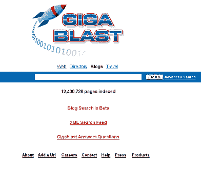
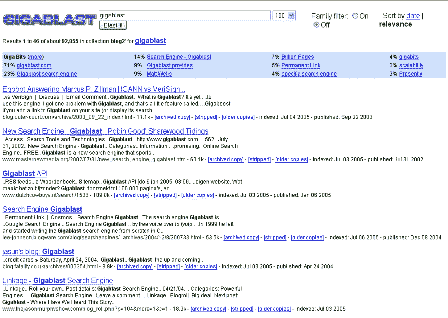

# 个人资料–giga blast(博客搜索)

> 原文：<https://web.archive.org/web/http://www.techcrunch.com:80/2005/07/09/profile-gigablast-blog-search/>

# 个人资料–giga blast(博客搜索)

**服务:** [Gigablast 博客搜索](https://web.archive.org/web/20220812102627/http://blogs.gigablast.com/)

**最近推出:**

**什么事？**

Gigablast 刚刚在 blogs.gigablast.com 推出了一个测试版博客搜索引擎。结果可以通过“revelvance”或日期查看。还有其他[高级搜索](https://web.archive.org/web/20220812102627/http://www.gigablast.com/adv.html)选项。但是，没有“标签”搜索。
 **截屏:**

**制单人:**

马特·威尔斯，首席执行官

链接:

【博客搜索网站
[点击](https://web.archive.org/web/20220812102627/http://blogs.gigablast.com/press.html)
[关于](https://web.archive.org/web/20220812102627/http://blogs.gigablast.com/about.html)
[About.com](https://web.archive.org/web/20220812102627/http://websearch.about.com/b/a/184462.htm)

标签: [gigablast](https://web.archive.org/web/20220812102627/http://www.technorati.com/tags/gigablast) 、 [search](https://web.archive.org/web/20220812102627/http://www.technorati.com/tags/search) 、 [blogsearch](https://web.archive.org/web/20220812102627/http://www.technorati.com/tags/blogsearch) 、[blog](https://web.archive.org/web/20220812102627/http://www.technorati.com/tags/blogs)、[blog](https://web.archive.org/web/20220812102627/http://www.technorati.com/tags/blogging)、[mattwell](https://web.archive.org/web/20220812102627/http://www.technorati.com/tags/mattwells)、 [techcrunch](https://web.archive.org/web/20220812102627/http://www.technorati.com/tags/techcrunch) 、 [web2.0](https://web.archive.org/web/20220812102627/http://www.technorati.com/tags/web2.0) 、 [profiles](https://web.archive.org/web/20220812102627/http://www.technorati.com/tags/profiles) 、 [reviews](https://web.archive.org/web/20220812102627/http://www.technorati.com/tags/reviews) 、