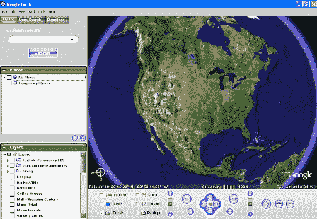
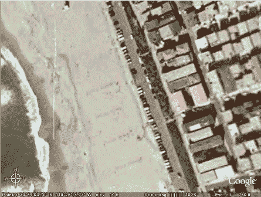
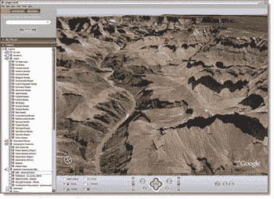
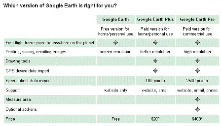
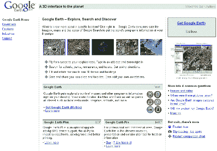
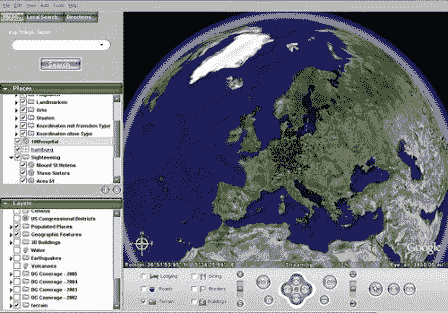

# 简介-谷歌地球(重新推出)

> 原文：<https://web.archive.org/web/http://www.techcrunch.com:80/2005/07/07/profile-google-earth-relaunch/>

**服务:** [谷歌地球](https://web.archive.org/web/20230307061636/http://earth.google.com/)

 **上一篇简介:**[2005 年 7 月 2 日](https://web.archive.org/web/20230307061636/https://techcrunch.com/?p=63)

**上市日期:**刚刚重新上市

**什么事？**

谷歌地球结合了卫星图像、航拍照片、地图和谷歌搜索，创建了一个有趣的应用程序，让你可以查看地球上任何地方的至少一些细节。目前只能在 PC 平台上使用。

用他们自己的话说，*“想法很简单。它是一个位于您电脑内部的地球仪。你指向并缩放到地球上任何你想探索的地方。卫星图像和当地事实放大到视图中。进入谷歌搜索显示当地的兴趣点和事实。缩放至特定地址以查看公寓或酒店。查看驾驶路线，甚至沿着您的路线飞行。我们邀请您现在就尝试一下。”* [链接](https://web.archive.org/web/20230307061636/http://earth.google.com/earth.html)

“谷歌地球将一个星球的图像和其他地理信息放在你的桌面上。观赏毛伊岛和巴黎等异国风情，以及当地餐馆、医院、学校等名胜。”链接[链接](https://web.archive.org/web/20230307061636/http://earth.google.com/)

这个想法很简单。这项技术将 Keyhole(一笔[收购](https://web.archive.org/web/20230307061636/http://www.google.com/press/pressrel/keyhole.html))与其他谷歌数据和工具结合在一起。视觉冲击是[惊艳](https://web.archive.org/web/20230307061636/http://earth.google.com/coverage/europe_lg.jpg)。

但是你能用它做什么呢？

嗯，很多事情。我们做的第一件事(可能每个人都这样做)是试图找到我们家的图像。这是我住的地方，在加州的曼哈顿海滩(我发誓，它就在海滩的中间):

他们还展示了一些非常漂亮的著名景点的照片。这是大峡谷，例如:

**除了视觉上的赏心悦目，还包括一些有用的生产力工具:**

–从太空飞到你的邻居家。键入地址并放大。
–搜索学校、公园、餐馆和酒店。获取驾驶路线。
–倾斜和旋转视图以查看 3D 地形和建筑。
–保存并分享您的搜索和收藏。甚至可以添加自己的注释。
[链接](https://web.archive.org/web/20230307061636/http://earth.google.com/)

从一个地方换到另一个地方的经历是迷人的。应用程序从您的当前位置缩小，沿地球移动到新位置，然后放大。你可以用鼠标移动屏幕位置(就像谷歌地图一样)。

**最低配置:**

有 10 mb 的下载。

–操作系统:Windows 2000、Windows XP
–CPU 速度:英特尔奔腾 PIII 500 MHz
–系统内存(RAM):128 MB
–200 MB 硬盘空间
–3D 显卡:支持 3D 的显卡，带 16MB VRAM
–1024×768，32 位真彩色屏幕
–网络速度:128 kbps(“宽带/有线互联网”)

**产品:**

有三种[产品](https://web.archive.org/web/20230307061636/http://earth.google.com/products.html)——免费、Plus 和 Pro。对比图表:

[链接](https://web.archive.org/web/20230307061636/http://earth.google.com/product_comparison.html)

**附加屏幕截图:**

**链接:**

[谷歌地球](https://web.archive.org/web/20230307061636/http://earth.google.com/)
[了解更多](https://web.archive.org/web/20230307061636/http://earth.google.com/earth.html)
[功能](https://web.archive.org/web/20230307061636/http://earth.google.com/tour/index.html)
[常见问题](https://web.archive.org/web/20230307061636/http://earth.google.com/faq.html)
[热门景点](https://web.archive.org/web/20230307061636/http://earth.google.com/sites/)
[产品](https://web.archive.org/web/20230307061636/http://earth.google.com/products.html)
[定价](https://web.archive.org/web/20230307061636/http://earth.google.com/product_comparison.html)
[flickr 标签:googleearth](https://web.archive.org/web/20230307061636/http://www-us.flickr.com/photos/tags/googleearth/)
[约翰·巴特利](https://web.archive.org/web/20230307061636/http://battellemedia.com/archives/001661.php) ( *“现在告诉我，搜索不是新的 GUI…..”* )
[弗雷德威尔逊](https://web.archive.org/web/20230307061636/http://avc.blogs.com/a_vc/2005/06/want_to_waste_a.html)
[Slashdot](https://web.archive.org/web/20230307061636/http://slashdot.org/article.pl?sid=05/06/28/1733229&from=rss)
[博客新闻频道](https://web.archive.org/web/20230307061636/http://google.blognewschannel.com/index.php/archives/2005/06/28/google-earth-lunching-for-free/)
[搜索引擎观看](https://web.archive.org/web/20230307061636/http://searchenginewatch.com/searchday/article.php/3516001)
[诚论](https://web.archive.org/web/20230307061636/http://sinceretheory.net/weblog/?p=489)
[得了根？](https://web.archive.org/web/20230307061636/http://www.gotroot.it/internet/google-earth/)
[哈利·洛夫](https://web.archive.org/web/20230307061636/http://staff.washington.edu/hlove/2005/06/30/2005-tour-de-france-with-google-earth/)(环法自行车赛)
[wongablog](https://web.archive.org/web/20230307061636/http://www.wandwaver.co.uk/blog/2005/06/29/google-earth/)
[doctor vee](https://web.archive.org/web/20230307061636/http://www.doctorvee.co.uk/2005/06/29/mince-salad/)
[精明的技术专家](https://web.archive.org/web/20230307061636/http://technosavvy.org/?p=243)
[谷歌地球黑客](https://web.archive.org/web/20230307061636/http://www.googleearthhacks.com/)

标签:[谷歌](https://web.archive.org/web/20230307061636/http://www.technorati.com/tags/google)，[谷歌地球](https://web.archive.org/web/20230307061636/http://www.technorati.com/tags/googleearth)， [techcrunch](https://web.archive.org/web/20230307061636/http://www.technorati.com/tags/techcrunch) ， [web2.0](https://web.archive.org/web/20230307061636/http://www.technorati.com/tags/web2.0) ，[地图](https://web.archive.org/web/20230307061636/http://www.technorati.com/tags/maps)，[锁眼](https://web.archive.org/web/20230307061636/http://www.technorati.com/tags/keyhole)