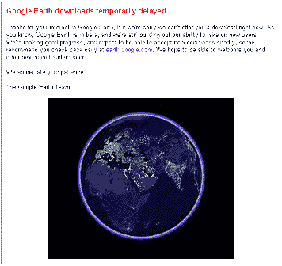

# 简介:谷歌地球| TechCrunch

> 原文：<https://web.archive.org/web/http://www.techcrunch.com:80/2005/07/02/profile-google-earth/>

**服务:** [谷歌地球](https://web.archive.org/web/20160910030311/http://earth.google.com/)

**上市日期:**？？？

**什么事？**

嗯，这将是一个很酷的工具，它“结合了卫星图像、地图和谷歌搜索的力量，让世界的地理信息触手可及。”

不过下载延迟了，暂时还不能测试。

虽然[预览](https://web.archive.org/web/20160910030311/http://earth.google.com/images/callouts.jpg)看起来很酷。直播的时候，我们会做侧写。

标签: [google](https://web.archive.org/web/20160910030311/http://www.technorati.com/tags/google) ， [googleearth](https://web.archive.org/web/20160910030311/http://www.technorati.com/tags/googleearth) ， [techcrunch](https://web.archive.org/web/20160910030311/http://www.technorati.com/tags/techcrunch) ， [web2.0](https://web.archive.org/web/20160910030311/http://www.technorati.com/tags/web2.0) ，[地图](https://web.archive.org/web/20160910030311/http://www.technorati.com/tags/maps)