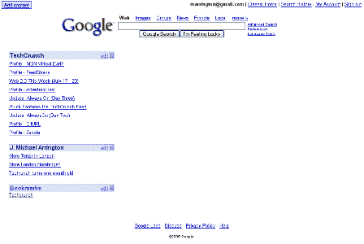
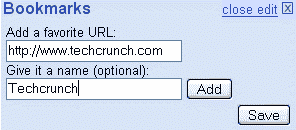
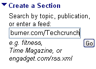
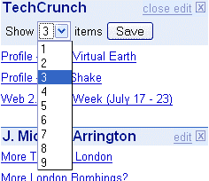
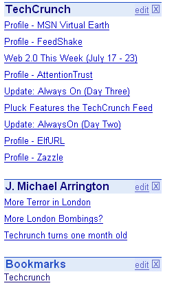

# 简介-谷歌 RSS 阅读器| TechCrunch

> 原文：<https://web.archive.org/web/http://www.techcrunch.com:80/2005/07/26/profile-google-rss-reader/>

# 个人资料–谷歌 RSS 阅读器

**服务:** [谷歌 RSS 阅读器](https://web.archive.org/web/20230326220710/http://www.google.com/ig)

**投放:**2005 年 7 月 25 日

**什么事？**

谷歌在其个性化主页上增加了 RSS 和书签功能。

书签功能是非常基本的——它给你的谷歌主页添加一个链接(可选标题)。如果他们加入美味或类似阴影的功能，会更有趣。

RSS 功能非常像雅虎的主页 RSS 阅读器，有很酷的选项，如设置显示的帖子数量(最多 9 个)，以及在屏幕上任何地方拖放提要的能力。对于 RSS 新手来说，或者如果你只有几个每天查看的 feeds，这是非常好的。

**链接:**

[鲁贝尔](https://web.archive.org/web/20230326220710/http://www.micropersuasion.com/2005/07/google_adds_rss.html)、 [RSS 博客](https://web.archive.org/web/20230326220710/http://rss.weblogsinc.com/entry/1234000117051940/)、[恶人台上的生活:第二幕](https://web.archive.org/web/20230326220710/http://wickedstageact2.typepad.com/life_on_the_wicked_stage_/2005/07/rss_wars_heat_u.html)、 [Error500](https://web.archive.org/web/20230326220710/http://www.error500.net/lector_rss_google_personalizado) 、[locker nome](https://web.archive.org/web/20230326220710/http://channels.lockergnome.com/rss/archives/services/20050726_google_online_rss_reader_worst_than_having_nothing_at_all.phtml)、[约翰·巴特利](https://web.archive.org/web/20230326220710/http://battellemedia.com/archives/001727.php)、[社交模式](https://web.archive.org/web/20230326220710/http://www.socialpatterns.com/search-engine-marketing/google-personalized-homepage-adds-rss/)

Technorati 标签: [google](https://web.archive.org/web/20230326220710/http://www.technorati.com/tags/google) ， [googlerss](https://web.archive.org/web/20230326220710/http://www.technorati.com/tags/googlerss) ， [rss](https://web.archive.org/web/20230326220710/http://www.technorati.com/tags/rss) ， [atom](https://web.archive.org/web/20230326220710/http://www.technorati.com/tags/atom) ，[雅虎](https://web.archive.org/web/20230326220710/http://www.technorati.com/tags/yahoo)， [techcrunch](https://web.archive.org/web/20230326220710/http://www.technorati.com/tags/techcrunch) ， [web2.0](https://web.archive.org/web/20230326220710/http://www.technorati.com/tags/web2.0)