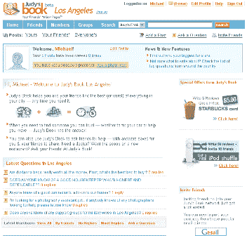

# 简介—朱迪的书 

> 原文：<https://web.archive.org/web/http://www.techcrunch.com:80/2005/07/15/profile-judys-book/>

**公司:** [朱迪的书](https://web.archive.org/web/20220817105542/http://www.judysbook.com/)

**发布日期:【2005 年 7 月**

**地点:**华盛顿州西雅图

**什么事？**

朱迪的书是一个允许人们写当地企业评论的网站。它还具有社交网络功能(添加朋友、群组等。)与信任网络共享评论。这个想法是，比起广告，人们更相信他们朋友的想法。

评论很容易写，有很多结构(评级，成本，利弊)和自由文本区，这将使搜索更容易(虽然没有标签-他们很快就会添加)。这有点像 [DinnerBuzz](https://web.archive.org/web/20220817105542/http://www.beta.techcrunch.com/?p=65) ，没有标签，有更多的社交网络。他们没有在网站上讨论，但他们显然使用了雅虎地图 api 或其他商业搜索数据库。

用他们自己的话说，朱迪的书是由安迪·萨克和克里斯·德沃尔在 2004 年开始的。当安迪和他的妻子 Alexa 搬到西雅图时，Alexa 的妈妈 Judy 给了他们她的“小绿皮书”，这是她个人对西雅图最好的服务提供商的看法。安迪和亚历克莎在他们定居到新的城市时，依靠朱迪的书来获得帮助和建议。当克里斯和他的妻子艾米丽需要一个勤杂工时，安迪从朱迪的书中推荐了一个想法:为什么不为各地忙碌的父母创建一个“小绿皮书”？朱迪的书就是这样的结果——为父母提供当地的答案。今天就加入，自己看吧！” [链接](https://web.archive.org/web/20220817105542/http://members.judysbook.com/signup/about.aspx)

这是一篇评论的视频:

为了让内容滚动，朱迪的书是行贿。:-)5 条评论可以让你在星巴克获得 5 美元，50 条评论+ 10 次好友邀请可以让你获得一台 iPod shuffle。好主意。

伟大的网站。但它是另一个需要不断更新的社交网络工具…因此会有一些牵引问题。该网站不提供用于搜索或标记的 RSS 源……他们很快就会意识到它的有用性并添加它。(Andy 和 Chris，如果你读了这篇文章，看看 Dinnerbuzz，看看他们做得对不对——你可以很容易地添加这个功能):-)

**创始人:**

安迪·萨克
克里斯·德沃尔

**相关链接:**

[关于](https://web.archive.org/web/20220817105542/http://members.judysbook.com/help/about.aspx)
[搜索引擎手表](https://web.archive.org/web/20220817105542/http://searchenginewatch.com/searchday/article.php/3518961)
[冲浪者冲浪](https://web.archive.org/web/20220817105542/http://www.surferssurf.com/cgi-bin/surfblog.pl?surfblog=711051)，[格雷格·亚德利](https://web.archive.org/web/20220817105542/http://www.yardley.ca/blog/index.php/archives/2005/07/16/judys-book-community-building/)

标签:[Judy book](https://web.archive.org/web/20220817105542/http://www.technorati.com/tags/judysbook)， [yellowpages](https://web.archive.org/web/20220817105542/http://www.technorati.com/tags/yellowpages) ， [localsearch](https://web.archive.org/web/20220817105542/http://www.technorati.com/tags/localsearch) ， [search](https://web.archive.org/web/20220817105542/http://www.technorati.com/tags/search) ，[评论](https://web.archive.org/web/20220817105542/http://www.technorati.com/tags/reviews)，[个人资料](https://web.archive.org/web/20220817105542/http://www.technorati.com/tags/profiles)， [techcrunch](https://web.archive.org/web/20220817105542/http://www.technorati.com/tags/techcrunch) ， [web2.0](https://web.archive.org/web/20220817105542/http://www.technorati.com/tags/web2.0) ， [socialnetworks](https://web.archive.org/web/20220817105542/http://www.technorati.com/tags/socialnetworks)