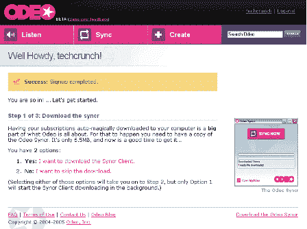
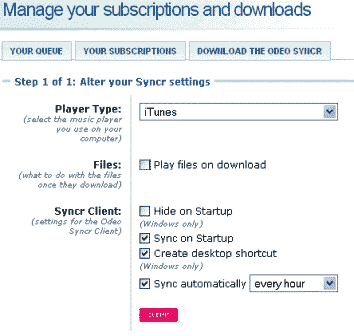
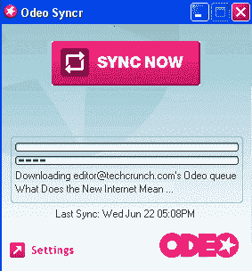

# 简介:Odeo(更新)TechCrunch

> 原文：<https://web.archive.org/web/http://www.techcrunch.com:80/2005/06/22/profile-odeo-update/>

编者按:如果下面的简介缺乏我们通常的兴奋和热情，我们道歉。Odeo 很棒，而且运行得非常好。我们只是有一种有趣的感觉，iTunes 4.9 将对播客门户市场产生实质性的影响。不过，有一点需要注意，iTunes 只是在线音乐市场的一部分，而不是全部。Odeo 和其他人可以帮助填补空白。

**公司:** [Odeo](https://web.archive.org/web/20220112100202/http://www.odeo.com/)

**以前的简介:**2005 年 6 月 13 日[链接](https://web.archive.org/web/20220112100202/http://www.beta.techcrunch.com/?p=13)

**有什么新消息？**

今天，许多 Odeo 测试版邀请函已经发出，TechCrunch 也收到了一份。我们报名了。我们做了一些事情。一切都正常，除了“创建播客”,他们一开始就告诉我们它不正常。

用他们自己的话来说，*“Odeo 由三个主要部分组成:各种类型的音频内容目录，它会不断地被添加进去。Odeo Syncr，它可以让你下载目录中的任何内容(也可以把它放到你的 MP3 播放器上)。和创作工具，包括 Odeo Studio，它允许你发布你自己的音频内容，这些内容将会出现在目录中。(不过，这些创作工具还没有公开使用。)"*

**关键附加信息:**

–6.3 兆同步下载(允许与 mp3 播放器轻松同步，自动添加等)。)
–来自比兹·斯通的非常做作的欢迎信息
–寻找/搜索播客“频道”并将其添加到您的订阅中的好工具
–“创建播客”功能仍未推出。
–syncer 非常好用

我的愿望清单–听完节目后自动删除选项(从 mp3 播放器)

**屏幕截图:**

**相关链接:**

参见上一篇简介
[导入播客](https://web.archive.org/web/20220112100202/http://odeo.com/create/import-feed)
[Odeo 博客](https://web.archive.org/web/20220112100202/http://odeo.com/blog)
[前 40 频道](https://web.archive.org/web/20220112100202/http://odeo.com/listen/top-40)

标签: [odeo](https://web.archive.org/web/20220112100202/http://www.technorati.com/tag/odeo) ，[播客](https://web.archive.org/web/20220112100202/http://www.technorati.com/tag/podcasting)， [web2.0](https://web.archive.org/web/20220112100202/http://www.technorati.com/tag/web2.0) ， [techcrunch](https://web.archive.org/web/20220112100202/http://www.technorati.com/tag/techcrunch) ，[播客](https://web.archive.org/web/20220112100202/http://www.technorati.com/tag/podcast)