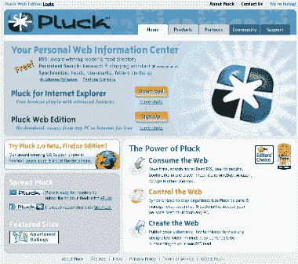
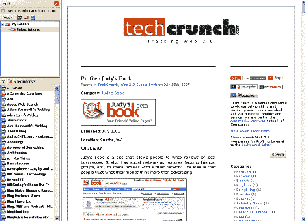
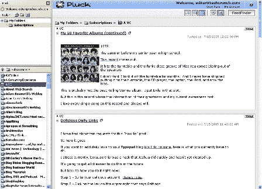

# profile–puck(针对 Firefox)

> 原文：<https://web.archive.org/web/http://www.techcrunch.com:80/2005/07/16/profile-pluck-for-firefox/>

**公司:** [拔毛](https://web.archive.org/web/20201204042326/http://www.pluck.com/)(火狐)

发布日期:2005 年 6 月 13 日(火狐 2.0 测试版)

**什么事？**

[puck](https://web.archive.org/web/20201204042326/http://www.pluck.com/)有许多优秀的产品，包括一个[基于网络的 RSS 阅读器](https://web.archive.org/web/20201204042326/http://www.pluck.com/content.aspx?screen_web)与 Bloglines、Newsgator 和其他公司竞争(见我们的 [Bloglines 诉 NewsGator 帖子](https://web.archive.org/web/20201204042326/http://www.beta.techcrunch.com/?p=74))以及一个非常受欢迎的 [IE 插件](https://web.archive.org/web/20201204042326/http://www.pluck.com/content.aspx?screen_ie)。

他们还悄悄推出了一个名为 [Shadows](https://web.archive.org/web/20201204042326/http://www.shadows.com/) 的社交书签网站，下周将增加更多功能。

几个月来，T22 一直在测试 Firefox 的插件，并于周三发布了 2.0 测试版。它很受欢迎(迄今已有 3000 多次下载)。

就是这个产品，火狐 2.0 测试版，在这里被描述。

**快速总结:**它太棒了，因为它的功能丰富且比我见过的任何聚合器都要快。它更新订阅源的速度似乎也很快。一旦更新的功能推出，我将从博客永久地切换到这个。

这是 Firefox 的扩展，所以下载很快，而且不像他们的 IE 插件，大部分工作是在服务器层面完成的。因此，该产品更像他们的“网络版”，而不是“为 IE 而战”。

通过 OPML 输入信息很容易。我能够很快地将它们组织到文件夹中，然后开始安装。

昨天我和 Matthew Bookspan 在 pull 谈论了这个产品(pull 也很好，一个月前让我们成为 beta 测试者，但我们在后续工作中惨败)。在这里看 Matt 关于产品[发布的博文。](https://web.archive.org/web/20201204042326/http://bookspan.easyjournal.com/entry.aspx?eid=2617161)

Matt 向我们保证，我们发现缺少的少数几个特性会在 bug/特性列表中很快添加。
 **特性:**

–自动同步所有 pull 产品的 feed
–通过 OPML 轻松导入 feed
–支持标签式浏览(在标签中打开 feed)
–发布/共享文件夹
–添加新内容的 bold feed
–选择 RSS feed 更新
–运行速度非常非常快
–轻松保存帖子/剪报
–feed 更新通知——状态栏中 pull 图标上方的一个小 toast 窗口:

**即将推出的功能:**

–显示每个订阅源的订阅者数量
–显示订阅源中未读项目的数量
–全部勾选为“已读”
–跨产品同步已读/未读项目(目前行业中最大的问题之一)

其他屏幕截图:

**管理:**

Dave Panos–首席执行官(联合创始人)
Andrew Busey–执行副总裁(联合创始人)
[链接](https://web.archive.org/web/20201204042326/http://www.pluck.com/display.aspx?team)

**投资者:**

奥斯汀创投
梅菲尔德
[链接](https://web.archive.org/web/20201204042326/http://www.pluck.com/display.aspx?investors)
 **相关链接:**

[摘下博客](https://web.archive.org/web/20201204042326/http://bookspan.easyjournal.com/)，[关于](https://web.archive.org/web/20201204042326/http://www.pluck.com/display.aspx?about)，[新功能](https://web.archive.org/web/20201204042326/http://www.pluck.com/products/features-firefox.htm)，[论坛](https://web.archive.org/web/20201204042326/http://www.pluck.com/phpbb/viewforum.php?f=55)，[特雷弗的博客](https://web.archive.org/web/20201204042326/http://trevor.dnpen.com/blog/trevor/2005/07/14/224538/pluck-20-beta-firefox-edition/)，[喂读者观看](https://web.archive.org/web/20201204042326/http://www.feed-readers.com/blog/posts/15)

标签:[啄食](https://web.archive.org/web/20201204042326/http://www.technorati.com/tags/Pluck)、[火狐](https://web.archive.org/web/20201204042326/http://www.technorati.com/tags/Firefox)、 [RSS](https://web.archive.org/web/20201204042326/http://www.technorati.com/tags/RSS) 、 [Atom](https://web.archive.org/web/20201204042326/http://www.technorati.com/tags/Atom) 、 [RSSReaders](https://web.archive.org/web/20201204042326/http://www.technorati.com/tags/RSSReaders) 、 [Techcrunch](https://web.archive.org/web/20201204042326/http://www.technorati.com/tags/Techcrunch) 、 [Web2.0](https://web.archive.org/web/20201204042326/http://www.technorati.com/tags/Web2.0)