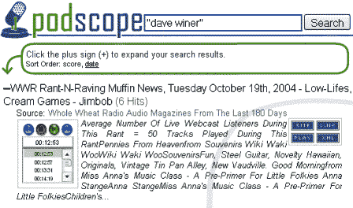
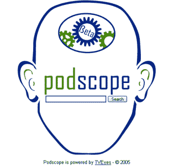
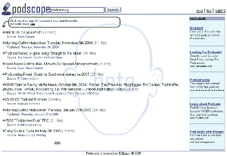

# 简介:Podscope 

> 原文：<https://web.archive.org/web/http://www.techcrunch.com:80/2005/06/17/profile-podscope/>

**公司:** [Podscope](https://web.archive.org/web/20230227051708/http://www.podscope.com/)

**地点:**康涅狄格州费尔菲尔德

**发布日期:**2005 年 4 月 19 日

**什么事？**

Podscope 使音频文件可以通过文本关键字进行搜索。它工作得很好。

搜索结果会显示包含该关键词的 podcast 列表，以及指向该 podcast 的链接。此外，你还可以听一小段 10 秒钟的选段，其中包括你要搜索的词。这需要 Macromedia Flash。

这对于研究和自我探索非常有用。例如，如果你[这里有一个链接](https://web.archive.org/web/20230227051708/http://www.podscope.com/search.php?s=&q=%22dave+winer%22)来搜索包含“戴夫·维纳”的播客。单击结果旁边的+号，您可以收听以下片段:

用他们自己的话说，*“什么是 Podscope？Podscope 是第一个允许你在任何音频或视频文件中搜索单词的搜索引擎。我们从播客开始，并将在未来几个月增加所有类型的多媒体。
它是如何工作的？就像其他搜索引擎一样。您在输入框中输入一个单词或短语，我们将向您显示结果列表。通过点击每个结果旁边的(+)号，您可以选择音频片段，以帮助您决定是听完整个播客还是订阅。如果你知道书内搜索，那就是我们为音频/视频所做的。不，我是说这项技术是如何运作的？
嗯，我们可以告诉你，但是我们必须，嗯，魔法。”*

该公司要么附属于 tyeyes，要么使用 tyeyes 的技术。

有几个易于添加的功能会使它非常有用——持久搜索和搜索的 RSS 提要。我敢打赌，他们很快就会被添加。

**屏幕截图:**

**相关链接:**

[常见问题](https://web.archive.org/web/20230227051708/http://www.podscope.com/blog/?page_id=4faq)
[提交播客](https://web.archive.org/web/20230227051708/http://podscope.com/submiturl.php)
[podscope 博客](https://web.archive.org/web/20230227051708/http://www.podscope.com/blog/)
[美味标签:pod scope](https://web.archive.org/web/20230227051708/http://del.icio.us/tag/podscope)
[pod scope 上的 community guy](https://web.archive.org/web/20230227051708/http://www.communityguy.com/index.cfm?CommentID=293)
[pod scope 上的 media post](https://web.archive.org/web/20230227051708/http://publications.mediapost.com/index.cfm?fuseaction=Articles.san&s=30101&Nid=13400&p=261902)
[pod scope 上的 MyDogII](https://web.archive.org/web/20230227051708/http://kmi.open.ac.uk/people/marc/index.php?p=254)(负面评论)