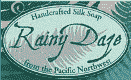
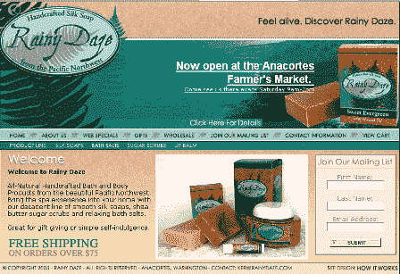

# 简介:雨天发呆

> 原文：<https://web.archive.org/web/http://www.techcrunch.com:80/2005/06/29/profile-rainy-daze/>

***编者按:**这是关于 Rainy Daze 的，但也是关于 web 1.0 向 web 2.0 的演变，Rainy Daze 是这种讨论的有用管道。*

**公司:** [雨天发呆](https://web.archive.org/web/20160530145517/http://www.rainydaze.com/)

 **为什么 Rainy Daze 会在 Techcrunch 上被侧写？**

雨天发呆不是 web 2.0。它尖叫着 web 1.0。

但这是有原因的。今天看了一篇文章(引用自[什么是 Web 2.0？Troy Angrinon 写的《转变范式:从 web 1.0 到 web 2.0 的 17 个步骤的心智进化过程》(我注意到，他是和 Qumana 一起写的)。](https://web.archive.org/web/20160530145517/http://www.whatsweb20.com/)

这篇文章最初是给一个朋友的电子邮件，Troy 决定把它贴到他的博客上。TechCrunch 存在的部分原因与此类似。不断有朋友问我们关于 web 2.0 以及定义 web 2.0 的公司和产品的问题，所以我们决定写关于他们的博客。写关于有趣事情的博客比进行许许多多一对一的谈话要容易得多。

Troy 的文章让我想起了去年由 [Fred Wilson 写的一篇名为博客 1.0](https://web.archive.org/web/20160530145517/http://avc.blogs.com/a_vc/2005/02/blogging_10.html) 的文章。如果有朋友问你为什么博客和地理城市不同，这是一本必读的书。我在我的个人博客中写了这篇文章，补充了一些我认为重要的事情(博客如何因更好的软件而成为可能(Troy 谈到了这一点)以及他们如何利用网络效应)。

那么为什么下雨发呆呢？上周，我和基思·特雷去了 Gnomedex，住在西雅图北部一个叫 Anacortes 的小镇上。一天晚上吃饭时，我们遇到了当地的一对夫妇(Keri 和 Jonathan ),他们很友好，听我们讨论了那天微软宣布支持 RSS 的意义，以及这对网络的发展有多么重要，多么重要。他们很感兴趣(真的！？)并且似乎想了解所有的新技术将如何影响他们。然后他们告诉我们 Rainy Daze，这是一个他们在家经营的网站，在那里他们出售手工制作的肥皂和其他沐浴用品。

我相信很快有一天，像 Rainy Daze 这样的网站将会加入 web 2.0 的特性，很可能来自我们在 Techcrunch 上已经或将要介绍的公司。

我还认为，考虑这样的网站很重要，因为最终我们今天所做的事情会影响人们的生活。

**什么事？**

雨天发呆有很酷的东西。用他们自己的话说，*“Rainy Daze 开始于用精油的美妙气味创造和增强全天然护肤品的想法。我们的产品与商业制造产品相比是一个可喜的变化，因为它们是用你能认出的原料手工制作的，比如丝绸。添加丝绸会产生富含水分的肥皂，让你的皮肤感觉柔软光滑。我们还添加了保湿油，如荷荷巴油、甜杏仁油、鳄梨油、大麻籽油、乳木果油和可可脂，创造出令人难以置信的保湿效果。为了保持我们的天然做法，我们避免不必要的颜色和添加剂。我们只选择最好的配料，并为能为您提供一流的优质产品而自豪。*

1999 年，我们开始生产肥皂作为给朋友和家人的礼物。由于更换的请求，我们预见到了一个增长的机会，并微调了我们的流程，以便将我们的爱好变成一项业务。制皂是一种创造性的发泄方式，它给我们的生活带来了灵感，给了我们用双手工作的机会。我们对我们的产品线感到兴奋，并且绝对热爱我们所做的事情！"

我给我的父母买了一些他们的产品(实际上是很多产品),作为他们在岛上新家的乔迁礼物。太牛逼了。推荐你去看看。我想他们很快就会有一个博客来谈论他们正在做的事情。我希望这篇文章和上面链接的 Troy 的文章能对他们有所帮助。

**截屏:**

标签:[电子商务](https://web.archive.org/web/20160530145517/http://www.technorati.com/tag/ecommerce)，[广告](https://web.archive.org/web/20160530145517/http://www.technorati.com/tag/web1.0)， [web2.0](https://web.archive.org/web/20160530145517/http://www.technorati.com/tag/web2.0) ， [techcrunch](https://web.archive.org/web/20160530145517/http://www.technorati.com/tag/techcrunch)