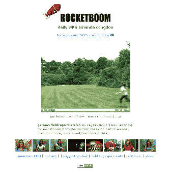

# 简介:rocket boom–TechCrunch

> 原文：<https://web.archive.org/web/http://www.techcrunch.com:80/2005/07/09/profile-rocketboom/>

公司: RocketBoom

**已启动:**

**位于:**纽约州纽约市

**什么事？**

RocketBoom 是一个非常受欢迎的周一至周五视频博客，或 vblog。这些片段很短——大约 3 -5 分钟(或更短),在美国东部时间上午 9 点发布。RocketBoom 的预算非常低——*“rocket boom 的制作成本不是数百万美元，而是一台消费级摄像机、一台笔记本电脑、两盏灯和一张地图，没有额外的开销或成本”* ( [链接](https://web.archive.org/web/20211205151337/http://www.rocketboom.com/vlog/about.html))。

用他们自己的话说，*“rocket boom 是一个总部设在纽约的每日三分钟视频博客。我们覆盖并创造了从顶级新闻故事到古怪的互联网文化的广泛的信息和评论。日程包括在美国东部时间周一至周五上午 9 点发布每个新片段。Rocketboom 非常强调国际艺术、技术和博客戏剧，通过在线视频呈现，并通过 RSS 广泛传播。* [链接](https://web.archive.org/web/20211205151337/http://www.rocketboom.com/vlog/about.html)

RocketBoom 女主播阿曼达·康登是该节目的明星。美联社称，她是一名有抱负的女演员，首次在 NBC 电视台的《餐厅》中扮演一名不满的衣帽间女孩。

关于其中一个“帖子”的示例，请参见此处的(主题:nasa tempe1 撞上彗星，rocketboom fireworks，itunes rss 视频教程，akimbo，akimbo review，karl rove 泄露中情局名称，谷歌视频首日被黑，谷歌分发盗版视频，滑板教练，音乐:[1，2]，苹果 itunes)。

[另一个](https://web.archive.org/web/20211205151337/http://www.rocketboom.com/vlog/archives/2005/06/rb_05_jun_29.html)，关于汤姆·克鲁斯(*“我不是同性恋/山达基之旅”*)

该网站有多个 RSS 源，目前每天大约有 25，000 次下载。

看看这个。它现在是我们的常规 RSS 源之一。

**附加屏幕截图:**

[链接](https://web.archive.org/web/20211205151337/http://www.chron.com/cs/CDA/ssistory.mpl/ae/tv/3244605)

**团队:**
[安德鲁男爵](https://web.archive.org/web/20211205151337/http://www.dembot.com/)，创作者
[阿曼达·康登](https://web.archive.org/web/20211205151337/http://www.amandacongdon.com/)，女主播
[约书亚·金伯格](https://web.archive.org/web/20211205151337/http://antisnottv.org/)，常规顾问
[弗兰克·小雅](https://web.archive.org/web/20211205151337/http://www.franklesser.com/)，视频编辑
[现场记者](https://web.archive.org/web/20211205151337/http://rocketboom.com/vlog/field.html)
[链接](https://web.archive.org/web/20211205151337/http://www.rocketboom.com/vlog/about.html)
 **链接:**

[火箭兵](https://web.archive.org/web/20211205151337/http://www.rocketboom.com/)
[关于](https://web.archive.org/web/20211205151337/http://www.rocketboom.com/vlog/about.html)
[档案](https://web.archive.org/web/20211205151337/http://www.rocketboom.com/vlog/archive.html)
[统计](https://web.archive.org/web/20211205151337/http://rocketboom.com/statistics/rb_stat_6_24_2005.html)
[博主博客](https://web.archive.org/web/20211205151337/http://www.bloggersblog.com/cgi-bin/bloggersblog.pl?bblog=630051)
[美联社](https://web.archive.org/web/20211205151337/http://www.chron.com/cs/CDA/ssistory.mpl/ae/tv/3244605)

标签:[火箭热潮](https://web.archive.org/web/20211205151337/http://www.technorati.com/tags/rocketboom)、[vblog](https://web.archive.org/web/20211205151337/http://www.technorati.com/tags/vblogs)、[视频博客](https://web.archive.org/web/20211205151337/http://www.technorati.com/tags/videoblogs)、[播客](https://web.archive.org/web/20211205151337/http://www.technorati.com/tags/podcasting)、[点评](https://web.archive.org/web/20211205151337/http://www.technorati.com/tags/review)、[个人资料](https://web.archive.org/web/20211205151337/http://www.technorati.com/tags/profile)、 [techcrunch](https://web.archive.org/web/20211205151337/http://www.technorati.com/tags/techcrunch) 、 [web2.0](https://web.archive.org/web/20211205151337/http://www.technorati.com/tags/web2.0) 、[amandacondon](https://web.archive.org/web/20211205151337/http://www.technorati.com/tags/amandacongdon)、[RSS](https://web.archive.org/web/20211205151337/http://www.technorati.com/tags/RSS)