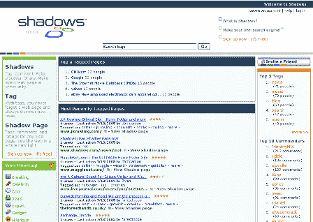
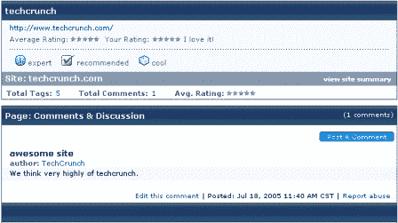
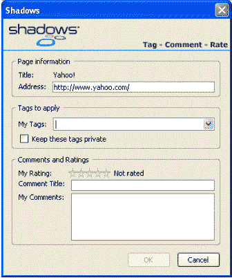
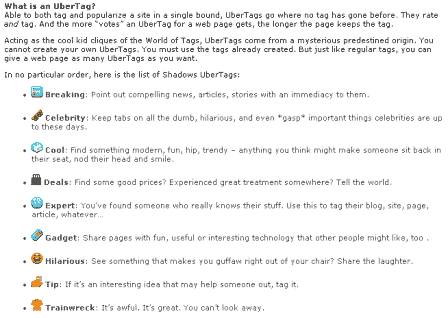

# 个人资料-阴影 

> 原文：<https://web.archive.org/web/http://www.techcrunch.com:80/2005/07/18/profile-shadows/>

***编者按:**今天是社会书签日，有 [Simpy](https://web.archive.org/web/20221001151601/http://www.beta.techcrunch.com/?p=91) 和现在 Shadows 的简介。Simpy 今天去了 TechCrunch，因为他们发布了我们非常喜欢的新功能。Shadows 才发布了几周，并将于本周在斯坦福大学的 AlwaysOn 会议上公开亮相(如果你在的话，请向我问好)，所以我们认为这也是介绍他们的合适时机。*

**服务:** [阴影](https://web.archive.org/web/20221001151601/http://www.shadows.com/)

**推出:**两周前

**位于:**德克萨斯州奥斯汀(这是一家[拔毛](https://web.archive.org/web/20221001151601/http://www.pluck.com/)公司)

**什么事？**

勇气是有目的的，我们喜欢它。上周，他们发布了 Firefox 扩展的 2.0 版本(见我们的[简介](https://web.archive.org/web/20221001151601/http://www.beta.techcrunch.com/?p=89)，我们仍然对此垂涎三尺(它快)。两周前，他们悄悄地推出了 Shadows，这是一个社会化书签网站。我们从他们的首席执行官戴夫·帕诺斯(Dave Panos)和联合创始人安德鲁·布西(Andrew Busey)那里了解到，他们将于本周在斯坦福的 AlwaysOn 公开宣布 Shadows。

正如我们提到的 [Simpy](https://web.archive.org/web/20221001151601/http://www.beta.techcrunch.com/?p=91) 一样，Shadows 应该与其他社交书签网站进行比较，如 [del.icio.us](https://web.archive.org/web/20221001151601/http://www.beta.techcrunch.com/?cat=19) 、 [Furl](https://web.archive.org/web/20221001151601/http://www.beta.techcrunch.com/?p=30) 、 [Yahoo My Web 2.0](https://web.archive.org/web/20221001151601/http://www.beta.techcrunch.com/?p=56) 、[和](https://web.archive.org/web/20221001151601/http://www.consultantcommons.org/node/239) [others](https://web.archive.org/web/20221001151601/http://www.dlib.org/dlib/april05/hammond/04hammond.html) 。

Shadows 有一个缺点:它们绝对需要安装 IE 或 firefox 工具栏，以便动态地为页面添加书签。这占用了宝贵的屏幕空间，通常很烦人。

然而，其功能远远弥补了实际损失——这是我们打算*保留*的工具栏，这是有充分理由的。工具栏不仅允许保存和标记页面，还允许您查看当前 URI 的“阴影页面”。阴影页面显示用户添加的标签、评论和其他元数据，这非常有用。以下是 Techcrunch 影子页面的内容(有些偏颇，因为目前我们是唯一一个为 Techcrunch 添加元数据的用户:-):

[链接](https://web.archive.org/web/20221001151601/http://www.shadows.com/shadows.aspx?url=http%3A%2F%2Fwww.beta.techcrunch.com%2F)

Shadows 似乎拥有其他社会化书签服务的所有高端功能(除了网站的服务器缓存？).有一件事我们还没有弄清楚——有添加好友的功能，但我们不知道添加好友会带来什么功能，因为用户将书签设置为公共或私人。我们喜欢在给页面添加书签时弹出的美味和卷起来的样子:

如上所述，它们也有阴影页面，还有一个叫做“ [ubertags](https://web.archive.org/web/20221001151601/http://www.shadows.com/help/FAQ.aspx#23b) 的漂亮功能，这是预定义的标签，如专家、酷等。，当然，其中许多都归功于 TechCrunch。

总的来说，阴影是非常酷的，我们期待着正式推出。

**管理:**

Dave Panos–首席执行官(联合创始人)
Andrew Busey–执行副总裁(联合创始人)
[链接](https://web.archive.org/web/20221001151601/http://www.pluck.com/display.aspx?team)

**投资者:**

奥斯汀创投
梅菲尔德
[链接](https://web.archive.org/web/20221001151601/http://www.pluck.com/display.aspx?investors)
 **相关链接:**

[FAQ](https://web.archive.org/web/20221001151601/http://www.shadows.com/help/FAQ.aspx) ，[surfsurf](https://web.archive.org/web/20221001151601/http://www.surferssurf.com/cgi-bin/surfblog.pl?surfblog=713051)，[德克萨斯风险投资博客](https://web.archive.org/web/20221001151601/http://texasvc.weblogswork.com/?p=100)，[有些坦率](https://web.archive.org/web/20221001151601/http://www.somewhatfrank.com/2005/07/icerocket_and_p.html)

**标签:** [阴影](https://web.archive.org/web/20221001151601/http://www.technorati.com/tags/shadows)，[好吃的](https://web.archive.org/web/20221001151601/http://www.technorati.com/tags/delicious)， [del.icio.us](https://web.archive.org/web/20221001151601/http://www.technorati.com/tags/del.icio.us) ， [simpy](https://web.archive.org/web/20221001151601/http://www.technorati.com/tags/simpy) ， [furl](https://web.archive.org/web/20221001151601/http://www.technorati.com/tags/furl) ， [socialbookmarking](https://web.archive.org/web/20221001151601/http://www.technorati.com/tags/socialbookmarking) ， [socialbookmarks](https://web.archive.org/web/20221001151601/http://www.technorati.com/tags/socialbookmarks) ，[书签](https://web.archive.org/web/20221001151601/http://www.technorati.com/tags/bookmarks)， [techcrunch](https://web.archive.org/web/20221001151601/http://www.technorati.com/tags/techcrunch) ， [web2.0](https://web.archive.org/web/20221001151601/http://www.technorati.com/tags/web2.0)