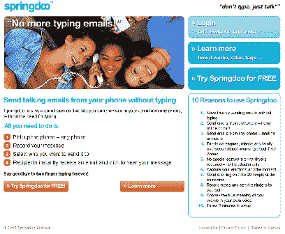
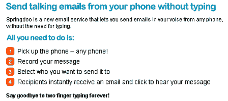
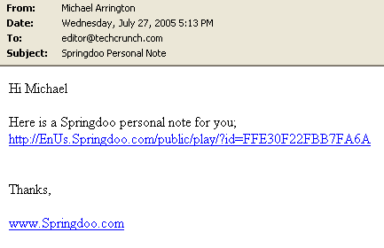
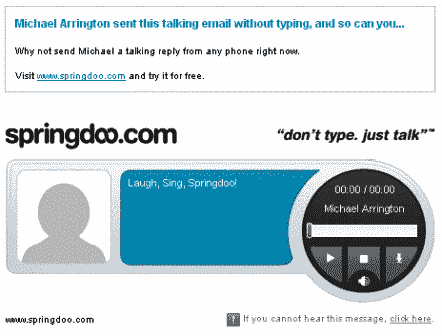
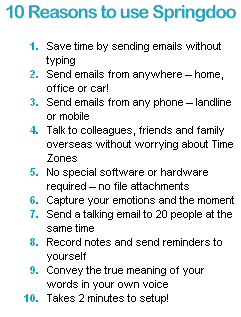
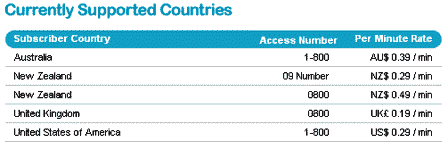

# 个人资料–SpringDoo–TechCrunch

> 原文：<https://web.archive.org/web/http://www.techcrunch.com:80/2005/07/27/profile-springdoo/>

**公司:** [春都](https://web.archive.org/web/20220112101341/http://www.springdoo.com/)

**今日在美国推出:**(之前仅在新西兰推出)

**什么事？**

Springdoo 是一种简单易用的服务，你可以拨打一个免费电话号码，记录一条信息，然后通过电子邮件将信息发送给你的联系人。这封邮件包含一个到 springdoo 网站的链接，在那里消息会被自动播放——它不是作为文件附件发送的。

这项服务不是免费的，但是注册后你可以免费使用 10 分钟。这项服务最少收费一分钟，第一分钟后每隔 20 秒收费一次。费用取决于记录的信息长度，所以如果你给 20 个人发一条一分钟的信息，只收取一分钟的费用。

目前在新西兰、澳大利亚、英国和美国都有销售。

它是这样工作的:你拨打电话号码(你的来电显示必须打开)，记录一条信息，选择要发送的电子邮件(最多 20 封)并发送。收件人收到一封电子邮件，点击链接并收听邮件。

在这里可以听到一个示例消息[。我们已经](https://web.archive.org/web/20220112101341/http://ennz.springdoo.com/public/play/?id=FDB603BBFEE0F1DE)[在这里](https://web.archive.org/web/20220112101341/http://enus.springdoo.com/public/play/?id=FFE30F22FBB7FA6A)记录了一条测试消息。是的，“苏素”比我性感多了，还有很酷的新西兰口音。:-)

**附加屏幕截图:**

**团队:**

首席执行官杰森·克尔

**链接:**

[简单邮件](https://web.archive.org/web/20220112101341/http://simplyemail.info/blog/?p=386)，[关于](https://web.archive.org/web/20220112101341/http://www.springdoo.com/about_us.aspx)，[帮助](https://web.archive.org/web/20220112101341/http://enus.springdoo.com/Help.aspx)

**标签:** [springdoo](https://web.archive.org/web/20220112101341/http://www.technorati.com/tags/springdoo) ，[邮箱](https://web.archive.org/web/20220112101341/http://www.technorati.com/tags/email)，[语音信箱](https://web.archive.org/web/20220112101341/http://www.technorati.com/tags/voicemail)， [techcrunch](https://web.archive.org/web/20220112101341/http://www.technorati.com/tags/techcrunch) ， [web2.0](https://web.archive.org/web/20220112101341/http://www.technorati.com/tags/web2.0)