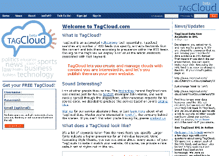
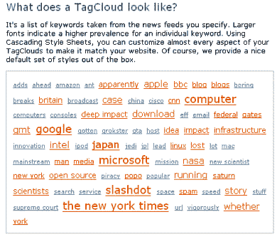
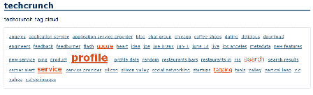
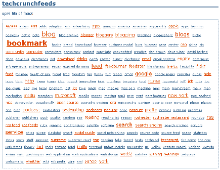
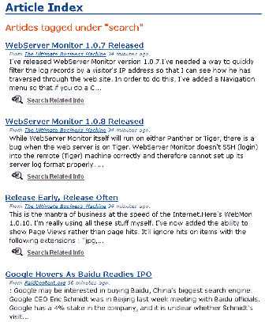
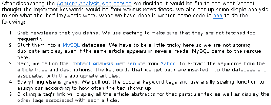

# 简介:TagCloud TechCrunch

> 原文：<https://web.archive.org/web/http://www.techcrunch.com:80/2005/07/05/profile-tagcloud/>

**服务:** [TagCloud](https://web.archive.org/web/20221006210534/http://www.tagcloud.com/)

**发布日期:【2005 年 6 月**

**地点:**宾夕法尼亚州贝尔伍德

**状态:**公司名称为 [IonZoft](https://web.archive.org/web/20221006210534/http://www.ionzoft.com/main/index.php)

**什么事？**

tagcloud 是一种基于提供的 URL 或提要生成“TagCloud”(见下文)的服务。标记云基本上是与来自单个或多个来源的内容相关联的一组标记。标签云是一种可视化工具——经常使用的标签比很少使用的标签更大和/或更暗，允许相对标签使用的可视化表示。点击标签会将用户带到与该标签相关的内容——基本上是与该标签相关的内容列表(排名通常是根据日期或新鲜度，但这不是必需的。

TagCloud 是一个创建 TagCloud 的工具。首先要指出的一个关键事实是，在创建标签云时，标签云使用关键字(文本)分析，而不是标签/类别分析。这是围绕该服务的一个争论点(或者至少是讨论点),值得您继续阅读。

下面是一个标签云的可视化示例(请记住，在真正的标签云中，每个项目都是可点击的，并链接到相关内容):

标签云之所以有用，而不仅仅是视觉上的娱乐，是因为它们以非常清晰的方式显示了最受欢迎的标签，并直接链接到相关内容。随着 RSS 聚合和搜索应用在不久的将来发生冲突，这将变得越来越重要(带下划线，因为两年后我会指着这篇文章说“我告诉过你”)。

如果你喜欢数学，我强烈推荐你阅读下面链接的 Pietro Speroni 的三篇关于 tagclouds 的文章。除了简洁的视觉技巧之外，这真的有一些东西。

TagClouds 是一种易于使用的服务，除了使用文本/关键词分析而不是类别/标签分析这一有争议的问题之外，唯一的问题是它们的生成速度非常慢。由于一个关键特性是将这些添加到您的博客中，加载时间可能会非常长。对于 Tagcloud 来说，一个简单的解决方案是定期缓存内容，并呈现缓存的(稍微过时的)内容，而不是在每次 html 或 xml 调用时重新生成标签云——我假设他们正在考虑这一点。速度问题是一个杀手，我更喜欢稍微旧一点的数据，而不是等待 2-3 分钟让我的博客在浏览器中完全加载。

**主要特性:**

–轻松注册
–基于单个订阅源或 url 轻松创建云
–基于一组订阅源轻松创建云
–导入 opml 文件轻松创建大规模云
–用于在网站上发布云的优秀工具
–每个云的专用 URL，采用 html 和 xml 格式
–在云中显示任意数量的标签，最多 250 个

正如 Pietro 所写的，单一信息源的标签集或标签云并不十分有趣。例如，以下是 Techcrunch 的标签云:

[链接](https://web.archive.org/web/20221006210534/http://www.tagcloud.com/cloud/html/techcrunch/default/50)(长加载时间)

相比之下，我们的整个 opml 文件的 tagcloud 有超过 200 个精彩博客和其他内容的提要(见这里的列表):

[链接](https://web.archive.org/web/20221006210534/http://www.tagcloud.com/cloud/html/techcrunchfeeds/default/250)(长加载时间)

这是一个更有趣的结果集。记住，点击任何标签都会得到一个结果集。以下是点击上面的“搜索”标签后的部分结果:

**技术:**

Tagcloud 使用雅虎的[内容分析 web 服务](https://web.archive.org/web/20221006210534/http://developer.yahoo.net/content/V1/termExtraction.html) 和简单的 php 将提要信息放入数据库，用雅虎工具进行分析并生成云:

[链接](https://web.archive.org/web/20221006210534/http://www.tagcloud.com/About.php)

鉴于他们对使用 tagcloud 创建新应用程序的开放态度，随着时间的推移，这可能是一项令人兴奋且非常有用的服务。

提示:如果聚合器每天为我所有未读的内容生成一个标签云，我会更容易阅读我感兴趣的帖子。这可以解决我们每天追踪越来越多的订阅源时面临的过载问题(现在每天阅读超过 200 个订阅源至少要花费我 2-3 个小时)。我希望看到的是基于标签和关键词的标签云。

**制单人:**

约翰·赫伦(他原来的实验[这里](https://web.archive.org/web/20221006210534/http://yahoo.theherrens.com/) )
 **链接:**

皮埃特罗·斯珀罗尼(Pietro speroni)关于 tagclouds 理论的概述:(不完全适用，因为 PS 是基于标签，而不是关键词) [#1](https://web.archive.org/web/20221006210534/http://blog.pietrosperoni.it/2005/05/25/tag-clouds-metric/) (好书目) [#2](https://web.archive.org/web/20221006210534/http://blog.pietrosperoni.it/2005/05/28/tagclouds-and-cultural-changes/) ， [# 3](https://web.archive.org/web/20221006210534/http://blog.pietrosperoni.it/2005/06/07/tag-clouds-and-spam/)
[tag cloud](https://web.archive.org/web/20221006210534/http://www.tagcloud.com/index.php)
[新闻](https://web.archive.org/web/20221006210534/http://www.tagcloud.com/News.php)
[关于](https://web.archive.org/web/20221006210534/http://www.tagcloud.com/About.php)
[实施指南(放在你的网站上)](https://web.archive.org/web/20221006210534/http://www.tagcloud.com/User/Implement.php)
[IONZoft](https://web.archive.org/web/20221006210534/http://www.tagcloud.com/IonZoft.php)
[Wired](https://web.archive.org/web/20221006210534/http://wired.com/news/technology/0,1282,67989,00.html?tw=wn_tophead_6)
[推荐 Web 工具](https://web.archive.org/web/20221006210534/http://www.recommendedwebtools.com/index.php/90/tagcloud-review/)
[projectized](https://web.archive.org/web/20221006210534/http://www.projectified.com/2005/06/tag_cloud_is_ve.html)
[Ben Ramsey](https://web.archive.org/web/20221006210534/http://benramsey.com/2005/06/08/tagcloud-php-news-cloud/)
[Hans on Experience](https://web.archive.org/web/20221006210534/http://hmestrum.blogs.com/my_weblog/2005/06/tagcloud_hans_o.html)
[Knowledge Jolt with Jack](https://web.archive.org/web/20221006210534/http://blog.jackvinson.com/archives/2005/06/07/my_own_ego_tag_cloud.html)
[搜索引擎](//web.archive.org/web/20221006210534/https://blog.searchenginewatch.com/blog/050607-065313)
[Marc Canter](https://web.archive.org/web/20221006210534/http://marc.blogs.it/archives/2005/06/tagcloud_seems.html)
[Stephan Mosel](https://web.archive.org/web/20221006210534/http://plasticthinking.org/2005/06/tag-cloud.html)

**相关:**

[皮特·弗莱塔格讲述如何制作标签云](https://web.archive.org/web/20221006210534/http://www.petefreitag.com/item/396.cfm)

标签: [tagcloud](https://web.archive.org/web/20221006210534/http://www.technorati.com/tags/tagcloud) ，[tagcloud.com](https://web.archive.org/web/20221006210534/http://www.technorati.com/tags/tagcloud.com)，[tagcloud](https://web.archive.org/web/20221006210534/http://www.technorati.com/tags/tagclouds)，[标签](https://web.archive.org/web/20221006210534/http://www.technorati.com/tags/tags)，[标签](https://web.archive.org/web/20221006210534/http://www.technorati.com/tags/tagging)，[标签集](https://web.archive.org/web/20221006210534/http://www.technorati.com/tags/tagsets)， [RSS](https://web.archive.org/web/20221006210534/http://www.technorati.com/tags/RSS) ， [XML](https://web.archive.org/web/20221006210534/http://www.technorati.com/tags/XML) ， [Techcrunch](https://web.archive.org/web/20221006210534/http://www.technorati.com/tags/Techcrunch) ， [Web2.0](https://web.archive.org/web/20221006210534/http://www.technorati.com/tags/Web2.0)