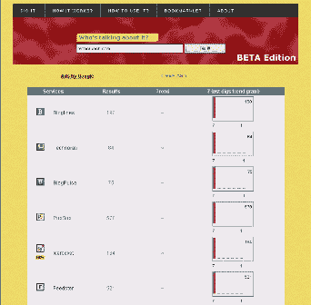

# Profile - Talk Digger | TechCrunch

> 原文：<https://web.archive.org/web/http://www.techcrunch.com:80/2005/07/31/profile-talk-digger/>

**什么事？**

TalkDigger 在给定的 URL 上查询主要的博客(和其他)搜索引擎，并返回该站点的链接总数以及其他数据。点击总链接数，您将看到所选的搜索引擎结果。

*“当你挖掘一个链接时，会出现 3 个具体的东西:*

1.结果。这是该 URL 的链接数量。如果你点击那个蓝色的数字，你将被重定向到搜索引擎的结果页面，并且能够知道谁链接到你。趋势。这是一个箭头，显示该搜索的结果数量是高于、低于还是与前一个相同。当你第二天早上醒来时，这真的很有效，你需要立即看到是否有人在晚上谈论你的博客。7 最后一个挖掘趋势图。这是一个图表，显示了搜索引擎在最近 7 次搜索请求中返回的结果的演变

这是一个非常有用的工具，可以用来做自我搜索，也可以用来比较搜索站点在任何给定查询下各自索引中的链接总数。不错的工具。

(通过[斯考伯](https://web.archive.org/web/20230307143332/http://radio.weblogs.com/0001011/2005/07/31.html#a10798)、[史蒂夫鲁贝尔](https://web.archive.org/web/20230307143332/http://www.micropersuasion.com/2005/07/talk_digger_blo.html)和[博客先驱报](https://web.archive.org/web/20230307143332/http://www.blogherald.com/2005/08/01/introducing-talk-digger/))

**附加链接:** [弗日里克·贾森](https://web.archive.org/web/20230307143332/http://fgiasson.com/blog/index.php?title=talk_digger_check_who_is_linking_to_you&more=1&c=1&tb=1&pb=1)，[弗日里克·贾森# 2](https://web.archive.org/web/20230307143332/http://fgiasson.com/blog/index.php?title=the_first_bookmarklet_developed_for_talk&more=1&c=1&tb=1&pb=1)(bookmarklet)[雨果·e·马丁](https://web.archive.org/web/20230307143332/http://hemartin.blogspot.com/2005/07/fred-on-something-delivers-talk-digger.html)，[有些坦白](https://web.archive.org/web/20230307143332/http://www.somewhatfrank.com/2005/07/who_is_linking_.html)， [jotsheet](https://web.archive.org/web/20230307143332/http://underscorebleach.net/jotsheet/2005/07/talk-digger) ， [Technoogle](https://web.archive.org/web/20230307143332/http://www.technoogle.com/?p=56) ，[蒂姆·杨](https://web.archive.org/web/20230307143332/http://timyang.com/2005/07/talkdiggercom-compares-the-number-of-inbound-links-to-your-site-from-nine-search-engines/)，[马修·赫斯特](https://web.archive.org/web/20230307143332/http://datamining.typepad.com/data_mining/2005/07/talkdigger.html)，[库剪辑](https://web.archive.org/web/20230307143332/http://libraryclips.blogsome.com/2005/08/01/231/)，【T2

**标签:** [链接](https://web.archive.org/web/20230307143332/http://www.technorati.com/tags/Links)，[搜索](https://web.archive.org/web/20230307143332/http://www.technorati.com/tags/Search)， [AJAX](https://web.archive.org/web/20230307143332/http://www.technorati.com/tags/AJAX) ，，[人气](https://web.archive.org/web/20230307143332/http://www.technorati.com/tags/Popularity)， [Bloglines](https://web.archive.org/web/20230307143332/http://www.technorati.com/tags/Bloglines) ， [Technorati](https://web.archive.org/web/20230307143332/http://www.technorati.com/tags/Technorati) ， [IceRocket](https://web.archive.org/web/20230307143332/http://www.technorati.com/tags/IceRocket) ， [Feedster](https://web.archive.org/web/20230307143332/http://www.technorati.com/tags/Feedster) ， [PubSub](https://web.archive.org/web/20230307143332/http://www.technorati.com/tags/PubSub) ，， [BlogPulse](https://web.archive.org/web/20230307143332/http://www.technorati.com/tags/BlogPulse) ，