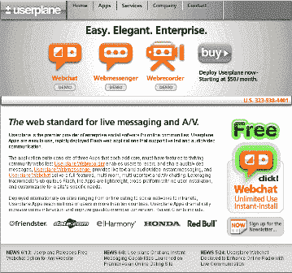
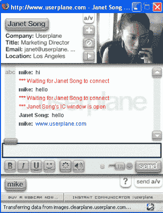
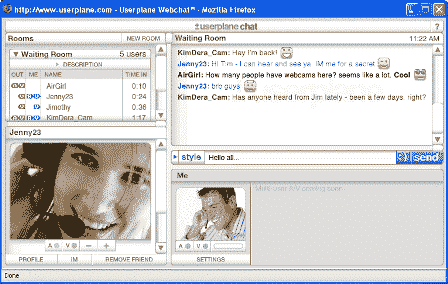
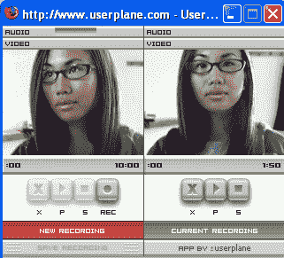

# 简介:用户平面——技术危机

> 原文：<https://web.archive.org/web/http://www.techcrunch.com:80/2005/07/01/profile-userplane/>

**公司:** [用户平面](https://web.archive.org/web/20220812204354/http://www.userplane.com/)

**成立:** 2001

**地点:**洛杉矶

**是什么？**

Userplane 是 web 2.0 公司的应用服务提供商。他们提供了一套基于 flash 平台的易于集成的服务，包括[聊天](https://web.archive.org/web/20220812204354/http://www.userplane.com/webchat/)、[群聊](https://web.archive.org/web/20220812204354/http://www.userplane.com/webchat/)、一款[web recorder](https://web.archive.org/web/20220812204354/http://www.userplane.com/webchat/)以及很快一款 [sitesearch](https://web.archive.org/web/20220812204354/http://www.userplane.com/sitesearch/) 产品。

典型的用户平面客户是约会和社交网站(任何有用户想要互动和/或创建包含音频/视频内容的个人资料的网站)。这些应用程序非常精致、直观，使用起来也很有趣。

用他们自己的话说，*“user plane 是在线社区企业社交软件的首要供应商。用户平面应用程序易于使用，可快速部署支持实时文本和音频/视频通信的 Flash web 应用程序。*

该应用套件由三个应用组成，每个应用都为蓬勃发展的社区网站添加了核心的必备功能:用户平面网络记录器使用户能够记录和共享音频/视频消息，用户平面网络信使提供实时文本和音频/视频即时消息，用户平面网络聊天提供全功能、多房间、多用户文本和 A/V 聊天。利用 Macromedia 无处不在的闪存，这些应用程序是轻量级的、跨平台的，无需用户安装，并且可以根据网站的特定需求进行定制。

从在线约会到社交网络，再到内部网，Userplane 应用程序在全球范围内部署，覆盖了十多个国家的数百万用户。用户平面应用程序极大地增加了在线互动，并改善了访客到会员的转换。"

**Webmessenger 产品:**

这是 Userplane 推出的第一款产品。Webmessenger 产品是包括文本、音频和视频功能的一对一即时消息客户端。Userplane 的营销总监 Janet Song 向我们展示了该产品:

**网聊产品:**

网聊就是群聊。它拥有 web messenger 的所有功能，还允许用户查看谁在看他们的视频和/或听他们的音频。它可以支持无限数量的用户，单个用户最多可以同时观看四个视频。

**Webrecorder 产品:**

这是一个网站可以添加的功能，可以方便地允许他们的用户记录和回放音频/视频消息。

这些产品部署在闪存平台上，并采用非用户平面品牌。价格从每月 50 美元开始(有一个免费版本的 webchat 产品[也支持添加)。集成可以像插入 html 脚本一样简单，或者站点可以选择完全集成到它们的数据库中，以包含用户的站点配置文件信息。](https://web.archive.org/web/20220812204354/http://www.userplane.com/press/userplane_061305.cfm)

Userplane 保持低调，但他们的客户是蓝筹股——包括 friendster、eharmony、本田、date.com 和红牛

**管理:**

迈克尔·琼斯—联合创始人兼首席执行官
纳撒尼尔·泽伦—联合创始人兼首席技术官
哈维尔·霍尔—联合创始人兼首席技术官
珍妮特·宋—营销总监

**链接:**

[博客](https://web.archive.org/web/20220812204354/http://www.userplane.com/)
[按下](https://web.archive.org/web/20220812204354/http://www.userplane.com/press/)
[雷达下](https://web.archive.org/web/20220812204354/http://ibdnetwork.typepad.com/undertheradar/2005/06/vcs_score_socia.html)

标签: [socialnetworking](https://web.archive.org/web/20220812204354/http://www.technorati.com/tags/socialnetworking) ， [onlinedating](https://web.archive.org/web/20220812204354/http://www.technorati.com/tags/onlinedating) ， [web2.0](https://web.archive.org/web/20220812204354/http://www.technorati.com/tags/web2.0) ， [techcrunch](https://web.archive.org/web/20220812204354/http://www.technorati.com/tags/techcrunch) ， [userplane](https://web.archive.org/web/20220812204354/http://www.technorati.com/tags/userplane)